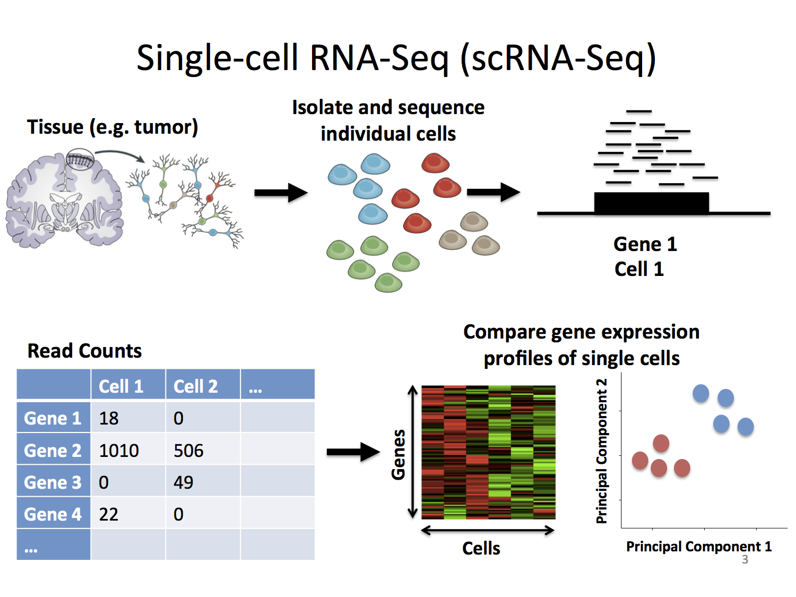

<!!! float-aside !!!> An expression profile is a representation of the activity (the expression) of thousands of genes for a single biological sample. 

In traditional, bulk gene expression studies we usually compare two or more types of tissue samples, for instance a healthy and pathological one. More specifically, we compare their **expression profiles**: the set of genes expressed in one sample is contrasted with the corresponding set expressed in the other in order to identify systematic differences in gene activity. 

Because a single sample is made up of hundreds to millions of cells, the measured expression level of any given gene effectively reflects something like **the average expression** across all the cells present in that sample. However, the cells that make up a sample can differ widely in their characteristics: they may have different functions and morphologies, or be in different developmental or cell-cycle states. For example, in the human retina we can find as many as 5 different types of neurons, each specialized to perform a certain function! Averaging gene expression across all cells therefore masks cell-to-cell variation, making it impossible to determine whether observed expression patterns arise uniformly across cells or from specific cell subpopulations. If we want to study the differences in the gene expression between different cells within a sample, we need techniques with a finer-grained resolution than what bulk gene expression sequencing techniques allow.

<!!! float-aside !!!> Single-cell sequencing examines the sequence information (e.g.DNA or RNA) from individual cells  

Here’s where single-cell sequencing comes in. Using optimized next-generation sequencing it allows us to measure **sequence information at the level of a single cell**. We can sequence both the _genome_ or the _transcriptome_ of a single cell, but in this tutorial we'll be focusing on gene expression or _transcriptomic_ studies. These simultaneously **measure the RNA concentration** (conventionally only messenger RNA (mRNA)) of hundreds to thousands of genes in a single cell. 

<!!! float-aside !!!> A gene expression profile of a single cell tells us something about it's function and state

The genes that are expressed in a certain cell are characteristic of its **function and of its state**. For instance, we expect similar gene expression profiles from two healthy liver cells and different expression profiles between a healthy liver cell and a cancerous one. This fine-grained resolution opens up new avenues for understanding complex biological processes, such as development, disease progression, and cellular responses to stimuli. 

The technology behind sequencing at the level of a single cell, however interesting, is not the topic of these notes. Rather, what we want to cover over the next few chapters is how to approach single-cell data once it has been obtained. In order to make sense of such data we need to analyze it. We will use **Orange** to perform just that in an easy and intuitive manner. 

