## Single Cell Datasets in Orange

In single-cell expression studies, the data are typically first represented as a count matrix. Each row usually corresponds to an individual cell, and each column corresponds to a gene, with the entries recording how many RNA molecules from a given gene were detected (counted) in a given cell. 

Let's look at an example. You can find a number of preloaded, publicly available single cell datasets which can be accessed through the [Single Cell Datasets](https://orangedatamining.com/widget-catalog/single-cell/single_cell_datasets/) widget. We will explore some of them in the following chapters.

<!!! float-aside !!!>
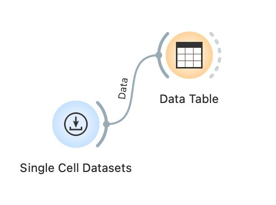

Let us start by constructing a workflow that consists of a [Single Cell Datasets](https://orangedatamining.com/widget-catalog/single-cell/single_cell_datasets/) widget and a [Data Table](https://orangedatamining.com/widget-catalog/data/datatable/) widget. The [Single Cell Datasets](https://orangedatamining.com/widget-catalog/single-cell/single_cell_datasets/) widget reads the data from the server. Open the widget by double-clicking its icon. The window shows a list of available datasets. Let's start with a smaller dataset, a sample from the study conducted by [Baron et al. (2017)](https://pubmed.ncbi.nlm.nih.gov/27667365/) composed of pancreatic cells from a single human donor. Double click on the line with this data set to instruct the widget to send the data to its output. After loading the data, open the [Data Table](https://orangedatamining.com/widget-catalog/) to see the data we have just loaded in the spreadsheet. 

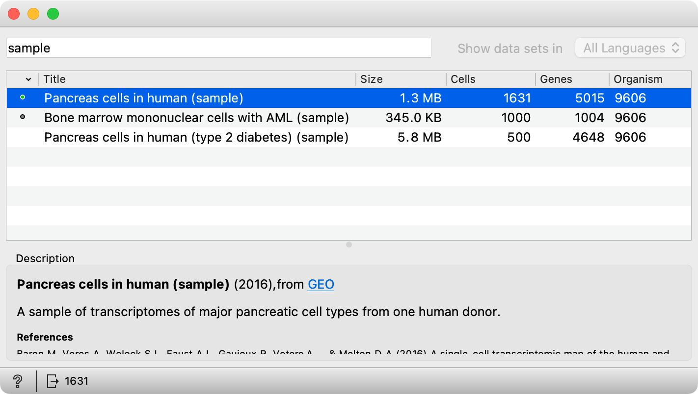&nbsp;  

<!!! float-aside !!!>
Counts signify how many copies of the expressed gene were detected in the cell

There are 1631 cells and 5010 genes in this dataset sample. Orange data items are stored in rows - in single cell transcriptomics, our data items are cells. The cell **expression profiles** are therefore stored in rows. Columns refer to meta-features and genes. Our example data includes _cell class_, _barcode_, _cell id_ and some other meta information. When the gene expression values are represented with **whole numbers**, this usually indicates that we are dealing with **counts**,  which **signify how many copies of the expressed gene were detected in the cell**. In other words, the numbers in the matrix tell us how many times we en**count**ered a RNA molecule of a gene in a particular cell. So, for instance, in the third row, we find a cell in which 0 RNA molecules of the genes AAAS and AACS were detected, but we encountered 12 transcripts of the gene AADAC. We call this kind of matrix a **count matrix**.  

<!!! width-max !!!>
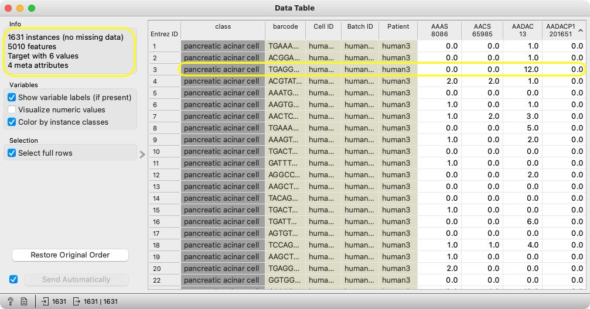&nbsp;    

<!!! float-aside !!!> Dropout refers to the phenomenon where a gene is expressed in a cell but not detected due to technical limitations, leading to false zero values

By scrolling through the data, you will notice that there are many zero values in our count matrix - single cell data is **sparse**. This is completely normal. Since scRNA-seq captures RNA from individual cells, lowly expressed genes may have only a few RNA molecules present in a given cell, making them easy to miss during sequencing. This phenomenon is called **dropout**. A zero value in the count matrix can therefore signify either that the gene was truly not expressed in a given cell or, more likely, that its expression was not detected. 

Let's look at another sample dataset. Open the [Single Cell Datasets](https://orangedatamining.com/widget-catalog/single-cell/single_cell_datasets/) widget again and select the dataset composed of bone marrow mononuclear cells, a sample of the data from [Zhang et al. (2017)](https://www.nature.com/articles/ncomms14049). Double click to load the data.

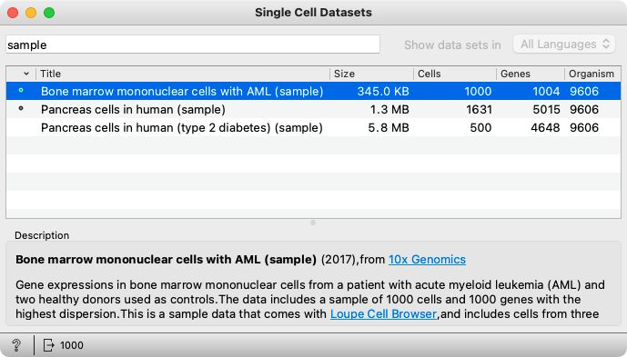&nbsp;  

Single-cell datasets can be quite large, so it often makes sense to begin analysis on a subset of the data. Although this dataset is already relatively small (as it is itself a sample of a larger dataset), we will use it to demonstrate how to create an even smaller sample. Let's forward the data to a [Data Sampler](https://orangedatamining.com/widget-catalog/transform/datasampler/) widget. Open the widget and sample 100 cells from the data. There are several sampling types to choose from: we select the Fixed sample size option, set the number of instances to 100 and press Sample Data. Forward the data to a new [Data Table](https://orangedatamining.com/widget-catalog/data/datatable/) and open it. 

<!!! float-aside !!!>
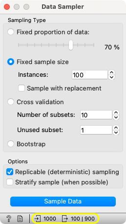

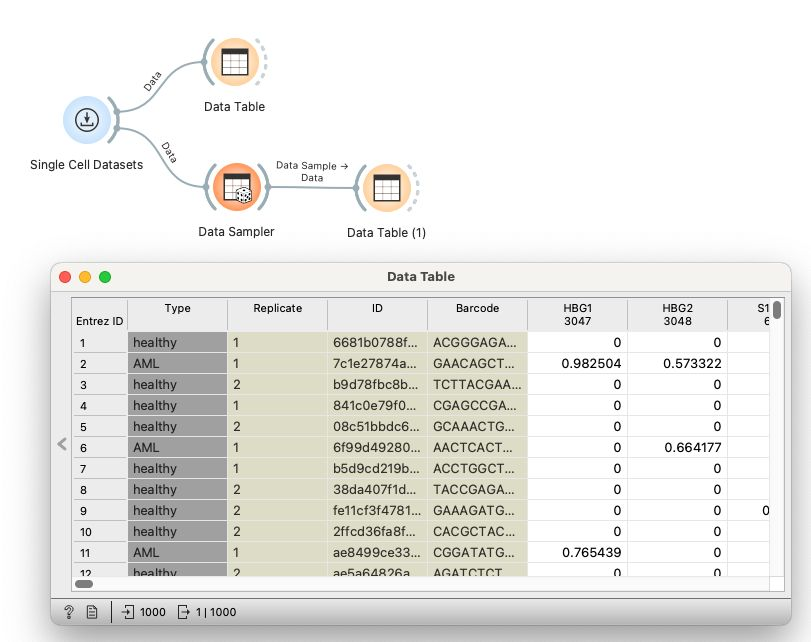&nbsp;  

<!!! float-aside !!!>
You can find the number of input and output instances displayed at the bottom of an Orange widget. By clicking on them, you can take a quick glimpse at the data in a pop-up data table.

In the columns, we can again identify meta-features such as _cell type_, _replicate_, _ID_, and _barcode_, along with genes. The rows correspond to individual cells. However, this time, expression values are represented as decimals rather than whole numbers. This indicates that the counts have most likely already been normalized.

Now, let's augment our workflow to visualize the data. Because single-cell gene expression data are high-dimensional - each cell is described by the expression levels of thousands of genes - they cannot be visualized directly. To make visualization possible, we first need to reduce the dimensionality of the data while preserving as much of its underlying structure as possible. 

For now let's take a quick glance at our data using a popular dimensionality reduction technique called t-SNE. Draw a line from the Data Sampler and search for the t-SNE widget. Click and wait for the widget to process the data. We will also add another Data Table at the output of t-SNE.

Open the t-SNE widget and select a few data points by drawing the rectangle around them. Now open the [Data Table(2)](https://orangedatamining.com/widget-catalog/) to observe how the data on selected cells are passed to the output of t-SNE. In Orange, most of the widgets are interactive, and send out the data upon any change in selection or any change of parameters of the widget.

<!!! width-max !!!>
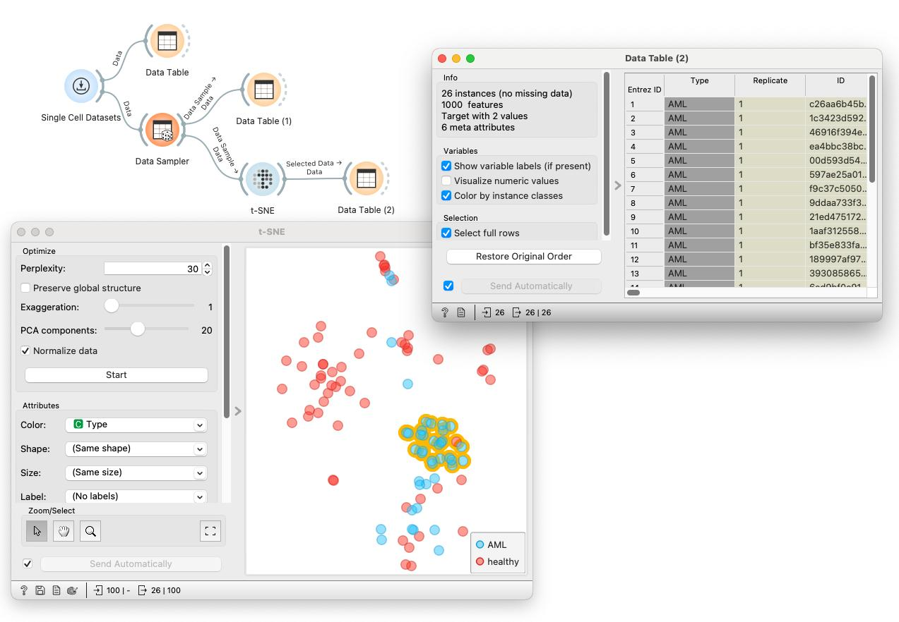

## Loading your own dataset

The datasets we have worked with in the previous chapter come from the server. Orange can also read the data from spreadsheet file formats which include tab, comma separated and Excel files. Let us prepare a toy dataset in Excel and save it on a local disk.

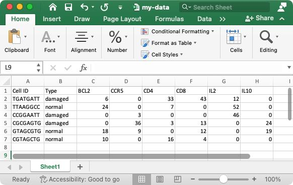&nbsp;  

We can use the [File](https://orangedatamining.com/widget-catalog/data/file/) widget to load this dataset.

<!!! float-aside !!!>
Instead of using Excel, we could also use Google Sheets, a free online spreadsheet alternative. Then, instead of finding the file on the local disk, we would enter its URL address to the [File](https://orangedatamining.com/widget-catalog/data/file/) widget ’s URL entry box.

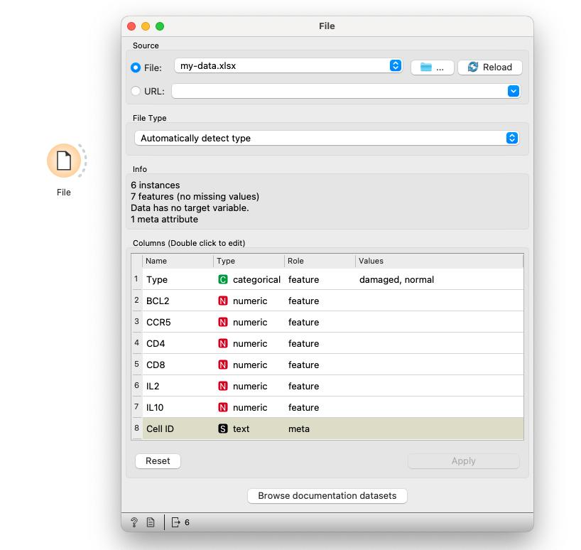&nbsp;  

Orange has correctly guessed that cell IDs are character strings and that this column in the dataset is special, meant to provide additional information and not to be used for any kind of modeling. All other columns are numeric features except for the type, which is a categorical feature. This is also the feature we wouldn't want to include in the profile of the cell and should rather consider it as a cell’s class. Double-click on the “feature” in the Role column and change the role of the feature type to “target”. Then click the Apply button. 

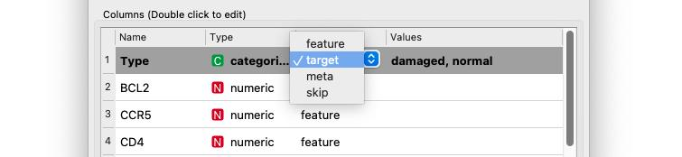&nbsp;  

It is always good to check if all the data was read correctly. We can connect our [File](https://orangedatamining.com/widget-catalog/data/file/) widget with the [Data Table](https://orangedatamining.com/widget-catalog/) widget, and double-click on the [Data Table](https://orangedatamining.com/widget-catalog/) to see the data in the spreadsheet format.

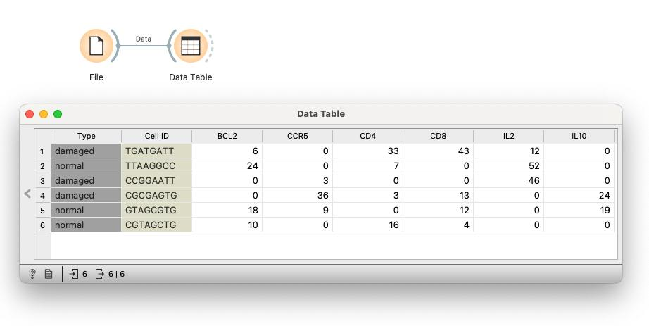&nbsp;  

There is more to input data formatting and loading. We can define the type and kind of the data column, specify that the column is actually a web address of an image, and more. But enough for now. If you would really like to dive in for more, check out the documentation page on [Loading your Data](https://orange3.readthedocs.io/projects/orange-visual-programming/en/latest/loading-your-data/index.html), or one of our [videos](https://www.youtube.com/watch?v=MHcGdQeYCMg&list=PLmNPvQr9Tf-ZSDLwOzxpvY-HrE0yv-8Fy&index=4&ab_channel=OrangeDataMining) on this subject. 