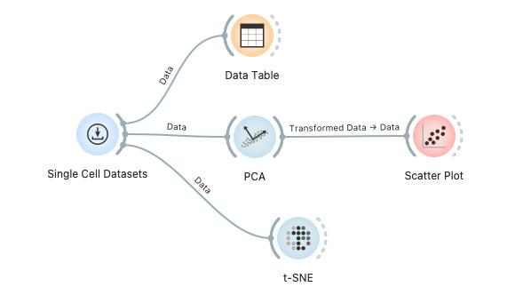
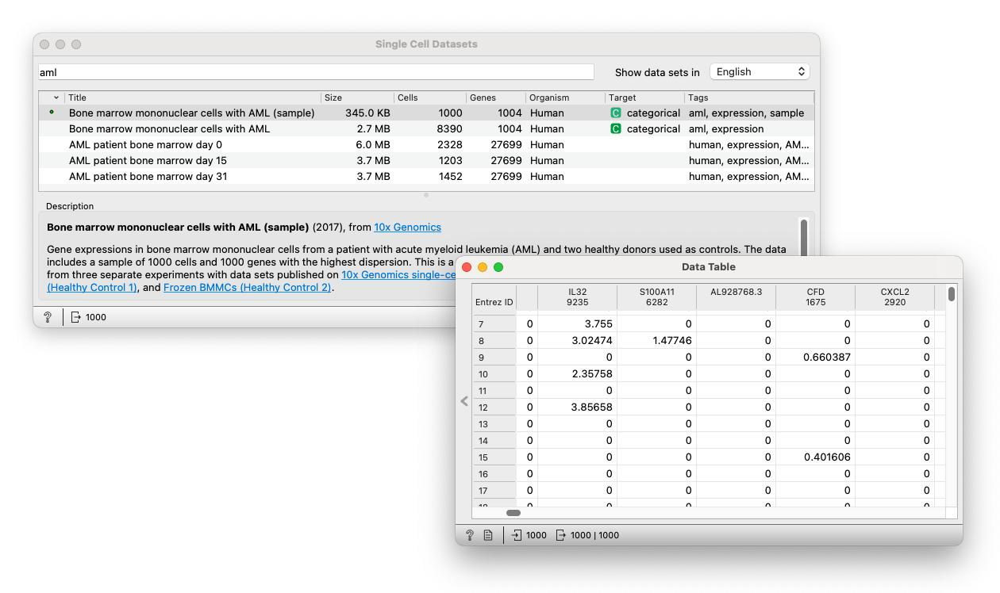
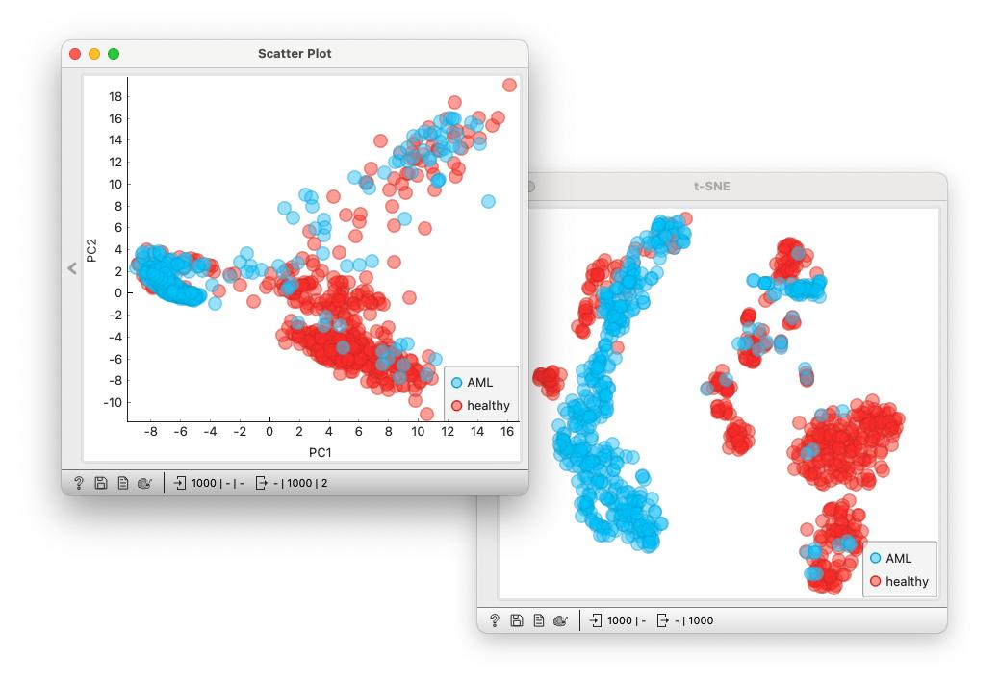
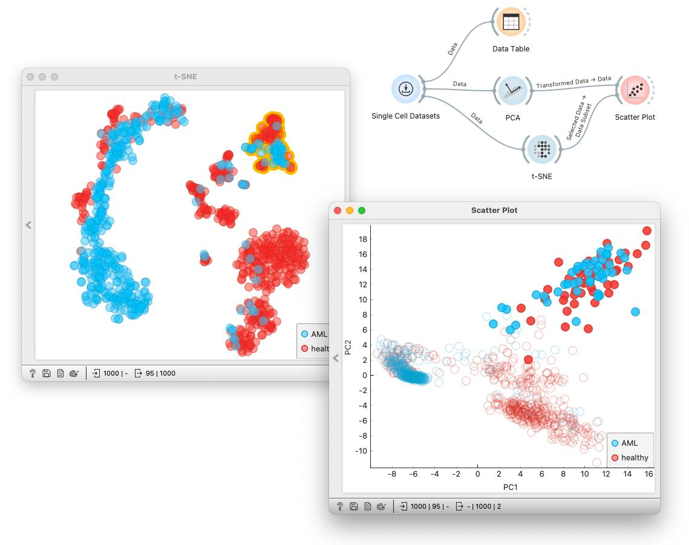

Let us load some single-cell gene expression data and organize the cells in two-dimensional visualizations. We will use the following workflow, and within it, compare two popular data visualization approaches, principal component analysis and t-distributed stochastic neighbor embedding. 

<!!! float-aside !!!>
&nbsp;  
[Single Cell Datasets](https://orangedatamining.com/widget-catalog/single-cell/single_cell_datasets/) connects to Orange’s data server that contains examples of datasets. You have to be connected to a network for this widget to work correctly.

From a list of examples in [Single Cell Datasets](https://orangedatamining.com/widget-catalog/single-cell/single_cell_datasets/), let us choose the data on mononuclear cells from bone marrow (Zheng et al., Nat Comm 2017). This data sets has already been preprocessed (to some degree) and comes with a selection of 1,000 genes. 

<!!! width-max !!!>

<!!! float-aside !!!>
To pass only the [PCA](https://orangedatamining.com/widget-catalog/unsupervised/PCA/) components to [Scatter Plot](https://orangedatamining.com/widget-catalog/visualize/scatterplot/) try rewiring the connection between the two widgets.

We pass the data to [PCA](https://orangedatamining.com/widget-catalog/unsupervised/PCA/) with the scree diagram, a chart that shows how much of the variance is explained with a first few components. [PCA](https://orangedatamining.com/widget-catalog/unsupervised/PCA/) transforms our data to a new coordinate system defined by principal components, where the components are orthogonal to each other and where the transformation is constructed so that the first component explains most of the variance, then second-most of the remaining variance, and so on.

A conceptually very different technique to PCA is [t-SNE](https://orangedatamining.com/widget-catalog/unsupervised/tsne/), which embeds the data into twodimensions so that cells with similar expression stay together.

<!!! float-aside !!!>
&nbsp;  
[t-SNE](https://orangedatamining.com/widget-catalog/unsupervised/tsne/) widget does not include axis. In fact, axis in t-SNE make no sense. Why? Because the coordinates of the points are not any two features of the original dataset, but a complex non-linear mapping of the original multidimensional data into only two-dimensions.

<!!! float-aside !!!>
&nbsp;  
To explore the differences between t-SNE and PCA, have both windows open, select the data in [t-SNE](https://orangedatamining.com/widget-catalog/unsupervised/tsne/), and observe the changes in [Scatter Plot](https://orangedatamining.com/widget-catalog/visualize/scatterplot/) showing [PCA](https://orangedatamining.com/widget-catalog/unsupervised/PCA/) projection. If Orange canvas window is getting in your way, use "Bring Widgets to the Front" command from the View menu.

PCA and t-SNE are two popular visualizations of single-cell gene expression data. Their visual depictions are often very different. PCA is a linear transformation that aims to be “more faithful” to the original data, while t-SNE aims to expose the clustering structure and focuses on preserving local similarities. We can compare the layout of the two visualizations by adding a connection from [t-SNE](https://orangedatamining.com/widget-catalog/unsupervised/tsne/) widget to the [Scatter Plot](https://orangedatamining.com/widget-catalog/visualize/scatterplot/) showing the [PCA](https://orangedatamining.com/widget-catalog/unsupervised/PCA/) projection. With it, a subset of cells selected in the [t-SNE](https://orangedatamining.com/widget-catalog/unsupervised/tsne/)  will be exposed in the [PCA](https://orangedatamining.com/widget-catalog/unsupervised/PCA/) plot.

<!!! width-max !!!>

