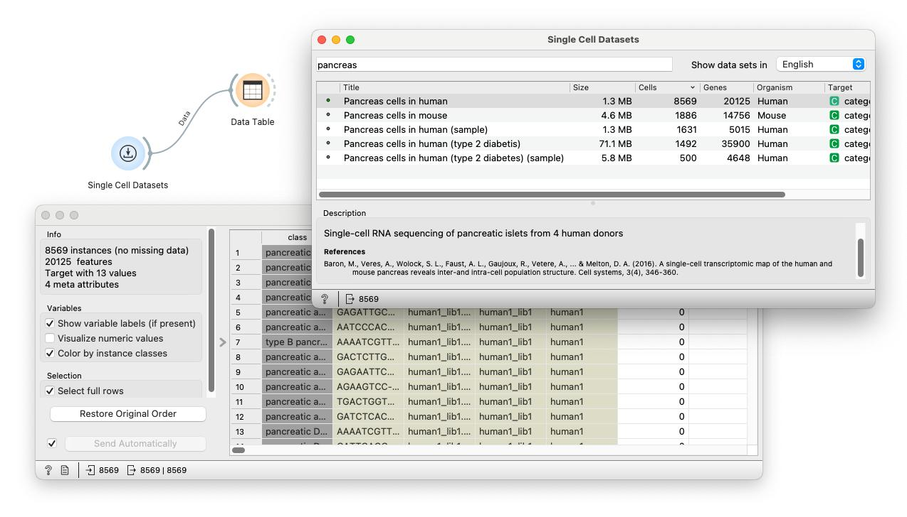
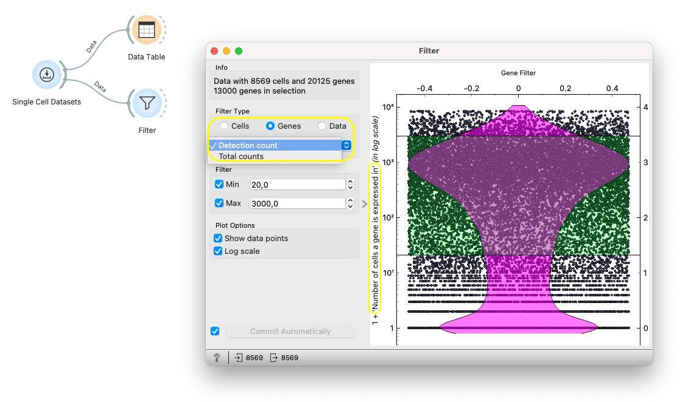
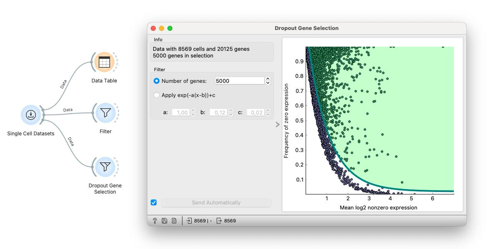
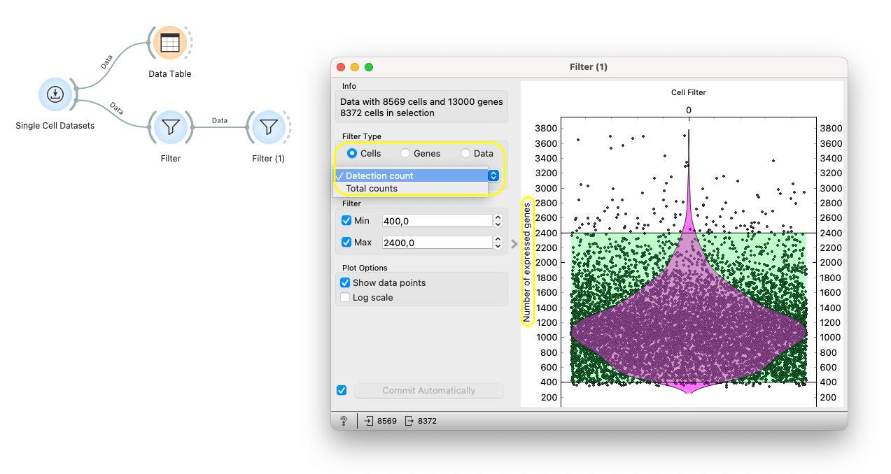
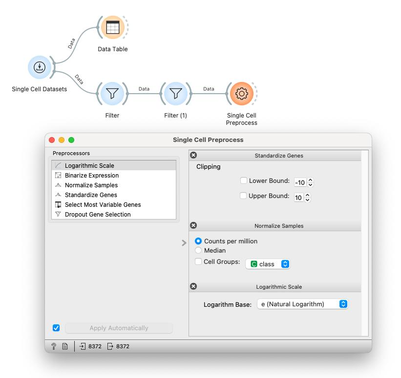

Single-cell datasets can have a lot of technical variability issues. Each cell will generally capture a varying number of reads. This will cause some cells to have too low of a signal to be useful. Additionally, genes range from ever-active housekeeping genes to specialized genes that are only expressed in particular cell types or under certain conditions. Employing filtering techniques and preprocessing steps becomes crucial to prepare the data for subsequent analyses.

## Filtering or quality control

To illustrate the process of filtering out low-quality data points and features, also called quality control, we'll use a dataset of pancreas cells from a human donor. We begin by loading the data using the [Single Cell Datasets](https://orangedatamining.com/widget-catalog/single-cell/single_cell_datasets/) widget. Once loaded, we examine its structure and individual cell features via the Data Table widget. 

<!!! width-max !!!>

This dataset comprises over 8000 cells and an extensive gene count exceeding 20,000!

Genes range from ever-active housekeeping genes to specialized genes only expressed in particular cell types or under certain conditions. Usually, we want to filter out both of these extremes - we can do so using the [Filter](https://orangedatamining.com/widget-catalog/single-cell/filter/) widget.

You can filter out cells by gene counts or genes by cell counts. Additionally, you can choose whether to filter by detection counts or total counts. For instance, filtering cells by gene detection count will use only the number of expressed genes in a cell as the filtering criteria, whereas filtering them by total count will use all the transcripts (the sum of the expression values) in a cell.

Since we want to first filter out genes, we select Genes as the filter type and further select to filter by the detection count of each gene. 

<!!! width-max !!!>

Each dot on the plot on the right now represents one gene. The y-axis marks the number of cells the gene has been detected in. We can choose to log scale the data for a better visualization. There are quite a lot of genes expressed in less than ten cells and quite a lot of housekeeping genes that are expressed in a vast number of cells. We can select which genes to keep by dragging the upper and lower thresholds on the plot. Alternatively, we can simply write the minimal and maximal number of genes we want to keep. Let's retain genes that have been detected in at least 20 and at most 3000 cells. This has reduced the number of genes by more than a quarter. 

Alternatively, we could use the Dropout Gene Selection widget to filter out uninformative genes. This widget implements a method proposed by a paper from 2018 that selects genes based on the interplay of mean expression across the cells and the frequency of dropouts, that is, the proportion of cells where the gene was not expressed. Any gene that has high dropout rate and high mean expression could potentially be a marker of some particular subpopulation of cells. Dragging the threshold changes how many genes are filtered out. 

<!!! width-max !!!>

Apart from filtering out non-informative genes, we might want to filter out whole cells. Each cell will generally capture a varying number of reads. This will cause some cells to have too low of a signal to be useful. Specifically, cells with fewer genes may suffer from damage or poor technical processing and thus provide less valuable information. But cells that express a very large number of genes or just contain a very high amount of expressed material are usually also not very informative. 

We can stack the [Filter](https://orangedatamining.com/widget-catalog/single-cell/filter/) widget one after the other. Since we want to filter out cells, we choose Cells as the filter type. There are again two options. We can either filter cells by the number of detected genes or by the total count of all transcripts. Let's select Detection count. Each point on the plot on the right now represents a cell, and the y-axis marks the number of expressed genes in those cells. Again, we can drag the threshold on the plot or simply type the desired minimal and maximum threshold on the left side of the widget. Let's filter cells that have less than 400 and more than 2400 expressed genes. 

<!!! width-max !!!>

## Preprocessing

After filtering out non-informative features (genes) and data samples (cells), we can proceed to preprocessing the expression values themselves. In Orange, this can be done through the [Single Cell Preprocess](https://orangedatamining.com/widget-catalog/single-cell/single_cell_preprocess/) widget by specifying an ordered list of preprocessing and data transformation steps. By default, the widget shows some standard preprocessing steps. Let's first remove these default steps and start from a blank pane.

One of the most common preprocessing steps is to transform the expression values so that they are comparable across cells. This process is called normalization. 

Let us first normalize the gene expression of each cell so that the gene expressions for each cell sum to the same number. Choose the "Count per Million" normalization. This normalization method scales the expression values based on the total number of reads in each cell and converts them into counts per million. Additionally, it's common to apply a logarithmic transformation after normalization to achieve a more symmetric distribution and to better handle extreme values. We simply drag and drop the Logarithmic Scale preprocessor from the list on the left to the right, just after the normalization step. We select to scale the data with the natural logarithm. You can choose from additional preprocessing steps from the list on the left. 

Our data is now ready for further analysis!
