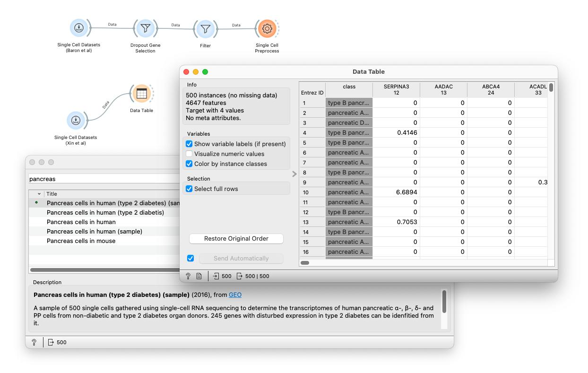
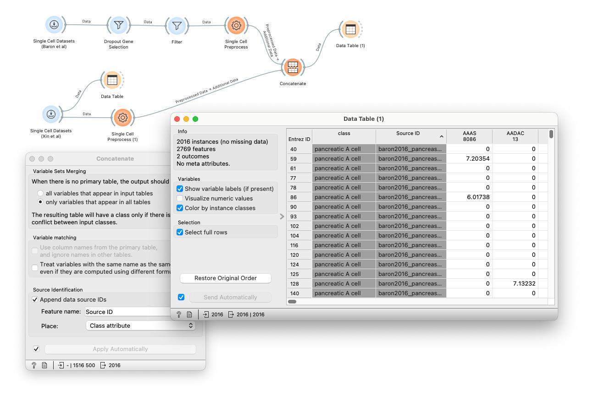
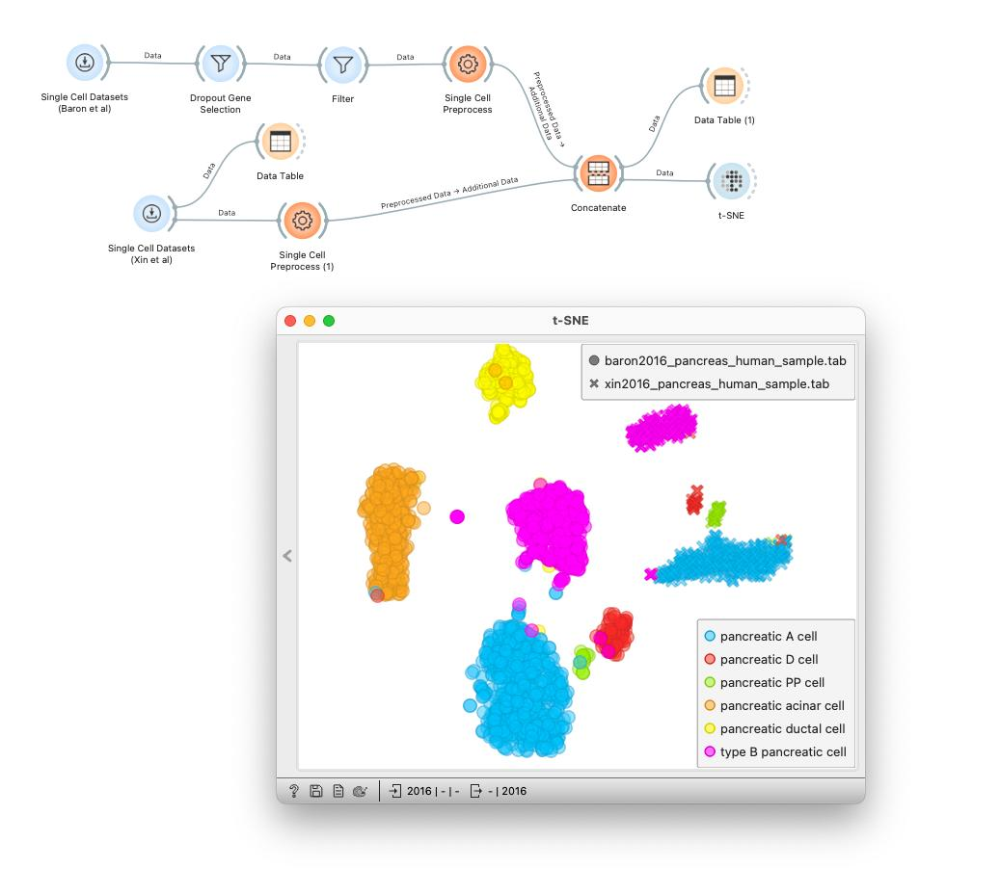
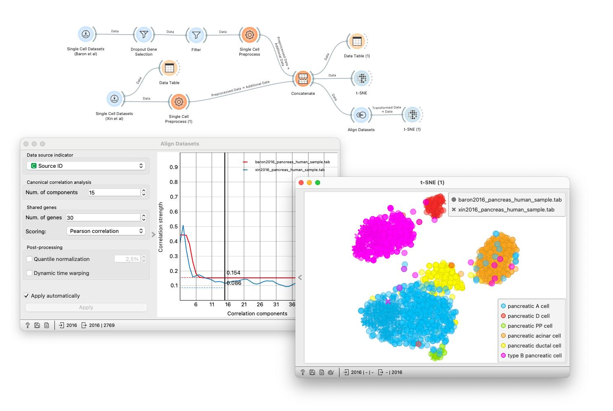
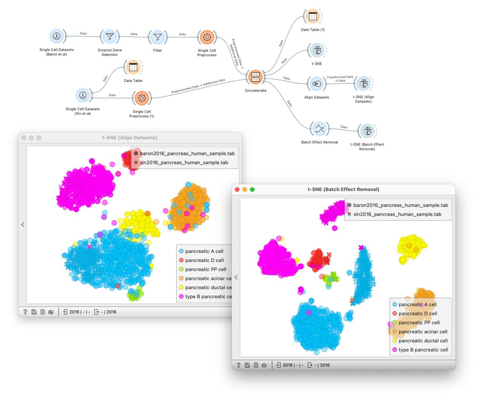
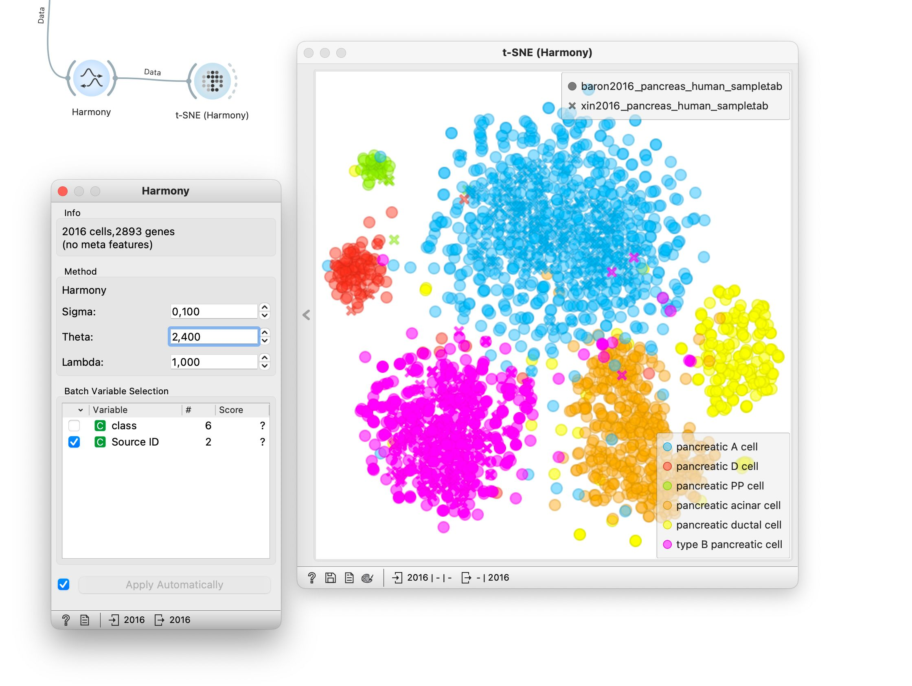

## Batch Effects Correction

<!!! float-aside !!!>
A batch is a group of samples (cells) that are processed together under the same experimental conditions

In single-cell analysis, we often work with data from multiple sources, such as different experiments, laboratories, or patient samples. A batch refers to a group of samples that were processed under the same technical conditions, for example, in the same lab, using the same protocol, reagents, or sequencing run. Differences between batches can introduce batch effects, which are sources of unwanted technical variation. These must be distinguished from biological variation which are typically the focus of analysis.

Batch effects are problematic because they obscure these biological differences and make comparisons between samples unreliable. Luckily, they can be dealt with computationally by aligning data from different batches. 

There are different approaches to align data sets and remove batch effects. Orange currently implements three: one through the [Batch Effect Removal](https://orangedatamining.com/widget-catalog/single-cell/batch_effect_removal/) widget, the second, more standard, using canonical correlation implemented in the widget [Align Datasets](https://orangedatamining.com/widget-catalog/single-cell/align_datasets/) and the third, most recently added, in the Harmony widget.

We will consider human pancreas cell data from two separate research studies: a sample from a study by [Baron et al.](https://pubmed.ncbi.nlm.nih.gov/27667365/) and the other a sample from a study by [Xin et al.](https://pubmed.ncbi.nlm.nih.gov/27667665/). We want to merge our two sample datasets, coming from distinct batches, and plot them together. But before we do that, let's apply some preprocessing steps.

For the dataset from [Baron et al.](https://pubmed.ncbi.nlm.nih.gov/27667365/) we have used the same preprocessing workflow as introduced in the previous chapter. To quickly recap, we start by dropping out some non-informative genes, then proceed to filter the cells by detection count, and then normalize the samples so that the gene expressions represent counts per million. We also apply a logarithmic transformation after normalization to achieve a more symmetric distribution. 

Let's apply some basic preprocessing steps to the second dataset as well. We can add another Single Cell Preprocessing widget onto the canvas and pass it the loaded data. We normalize using "Counts per Million" and apply a logarithmic transformation (natural logarithm). 

<!!! width-max !!!>

Now we can concatenate the two data sets by sending both to the [Concatenate](https://orangedatamining.com/widget-catalog/transform/concatenate/) widget. Here, I select the option to keep only the variables that appear in both tables and append the data source ID as a new class attribute. When we open the concatenated dataset in a table, we now see a new column called Source ID.

<!!! width-max !!!>

We now plot the concatenated data with t-SNE. Set the color to represent the cell class. Clearly, we got some nice clusters, but some of the same cell types were split into separate clusters. We would expect cells of a specific type to have similar expression profiles and therefore cluster together. If we set the shape of the plotted cells to represent the Source ID, we can see that two datasets are clearly separated: the data from Baron et al., marked by circles, appears on the left, and the data from Xin et al., marked with crosses, to the right. This clearly indicates the presence of batch effects that we want to remove. 

<!!! width-max !!!>

In our exploration of data integration methods, we'll first look at a technique that uses canonical correlation, implemented by the Align Datasets widget. This approach aims to optimize the transformation of data to improve correlations between expression vectors from two datasets. Let's navigate to the Align Datasets widget and examine its visualization of the correlation. First, we'll leave the parameters at their default settings and revisit the t-SNE plot. At first glance, it appears that the correction has yielded promising results, with similar cell types clustering together as expected. Furthermore, when we use shapes to represent the source of the data, we notice a closer proximity between cells from different sources.

<!!! width-max !!!>

Next, let's revisit the Align Datasets widget to fine-tune the parameters for potentially improved clustering. A common strategy is to start with a reduced number of components. Orange seamlessly propagates the transformed data to t-SNE, where we see an updated plot. The alignment between the two datasets appears significantly improved.

Let's explore the second data alignment method implemented by the Batch Effect Removal widget. We add this widget to our canvas and feed it the combined data. When opening the widget we have to set the distinguishing feature for different batches: in our case, this is the Source ID. We'll also leave the "Skip zero expressions" option unchecked. After applying this correction and visualizing the results in t-SNE, with colors representing cell classes and shapes representing data sources, we observe an interesting result. While some clusters of identical cell types from different sources merge into cohesive units, others remain distinct. It appears that the Align Datasets widget outperformed the Batch Effect Removal method in this case.

<!!! width-max !!!>

Let us now try Harmony, the third method available in Orange. Harmony has achieved good results in the [Batch integration benchmark study](https://openproblems.bio/benchmarks/batch_integration?version=v2.0.0), making it a robust general-purpose method for integrating single-cell datasets across batches. As before, we pass the concatenated data to the Harmony widget and specify Source ID as the batch-defining variable, leaving the remaining parameters at their default values for now. We then visualize the transformed data using t-SNE. The resulting plot shows that cells of the same type remain clustered together. What about the batch effect correction? To assess batch mixing, we set the Shape parameter to indicate the data source: this reveals that cells from different batches are now well mixed rather than forming separate clusters. By using Harmony we have effectively reduced batch effects while preserving biologically meaningful structure for downstream analysis.

<!!! float-aside !!!>
Among the three main parameters in Harmony (sigma, theta, and lambda), it is often useful to adjust theta, which controls the strength of batch correction: lower values result in weaker batch correction, whereas higher values enforce stronger mixing between batches.

