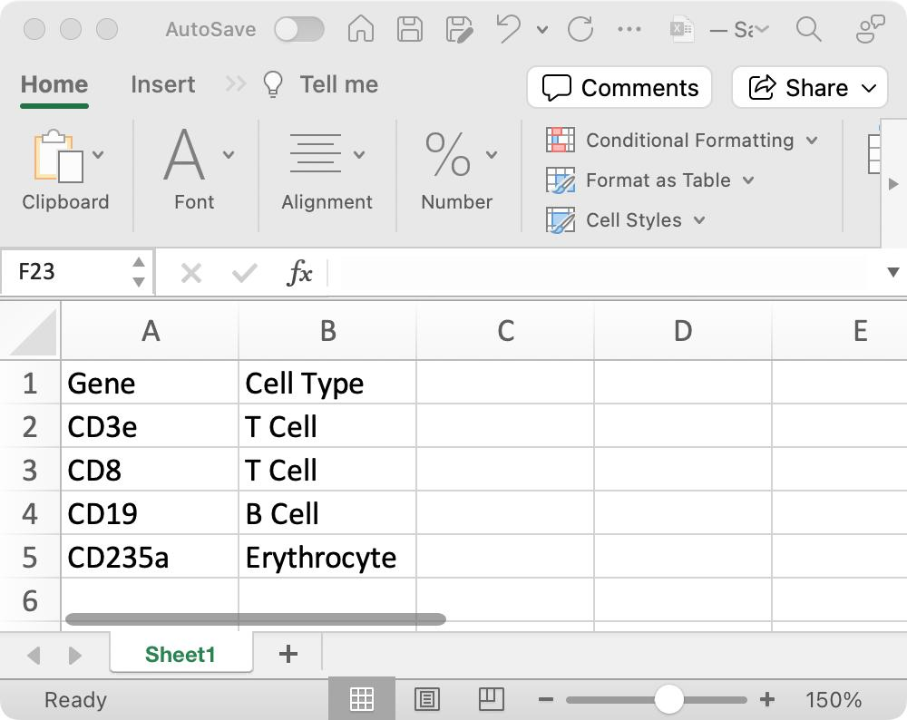
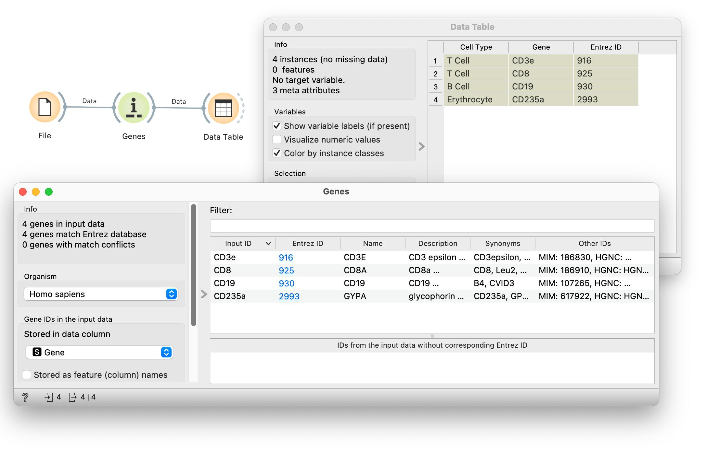
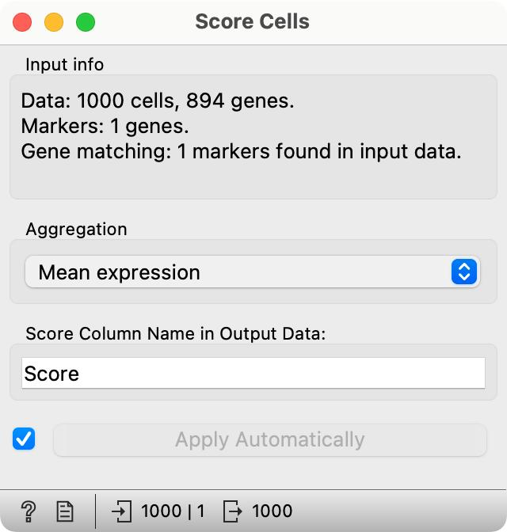
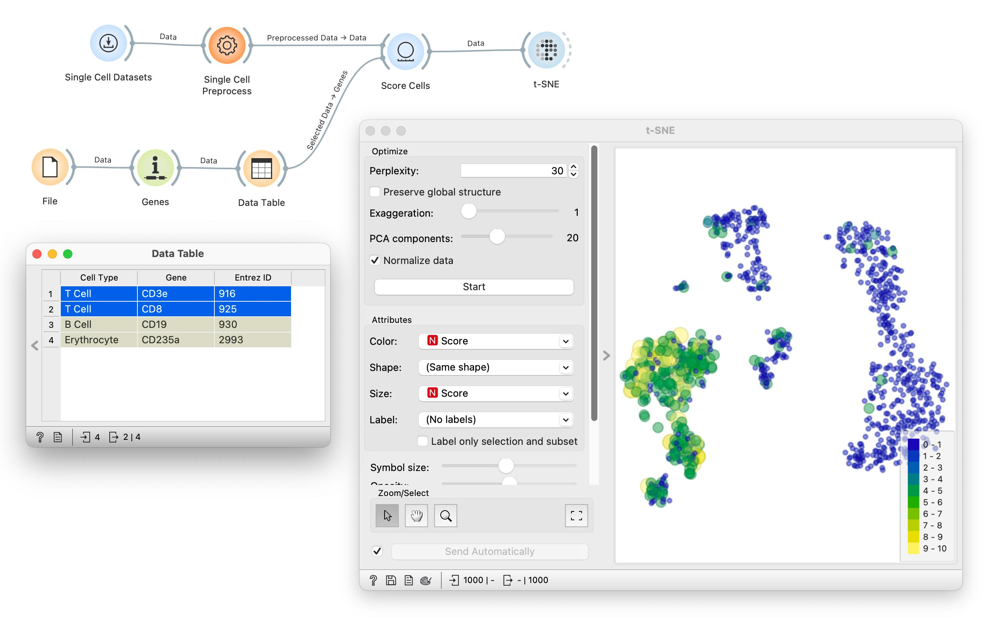

## Identifying cell types

Gene markers are one of the standard methods for discovering cell populations, determining cell states (e.g. cell cycle) and more. Here, we will continue to use a sample of the data on bone marrow mononuclear cells from previous lessons. We will score the cells according to gene markers, and observe the scored cells in the t- SNE visualization. We will assume, as it is often the case, that marker genes are keyed-in from some publication. We will only later resort to a list of marker genes from a public database.

<!!! float-aside !!!>
 

So, we start with the marker genes. We picked a few that are contained in our data. Here they are, keyed-in in Excel. 

For Excel, we can save this list in, say, marker-genes.xlsx, and load it with the File widget. Notice that we have used only the names of the genes, and not any official codes. Orange deals with genes through NCBI’s IDs, and we add them using Genes widget. This widget will also tell us if the names of the genes have been resolved correctly.

<!!! width-max !!!>
 

<!!! float-aside !!!>
 Score Cells adds a column Score to the input data table.

The output of the widget is a table that includes a gene name and cell type, both as specified in the input file, and Entrez ID. 

The idea is now that we would select the gene(s) from the data table, and then score the cells according to the mean expression of selected genes. Widget Score Cells assigns a numerical score to each cell that is proportional to an average expression of the marker genes at the input of the widget. The score is added as a meta attribute to the cell data on the output of Score Cells. Check this using the Data Table! We can now feed this data into t-SNE and set the color and size of the points to the cell score.

Notice that with any change in the selection of marker genes, we find a group of cells in t-SNE plot where these genes are expressed. Looks like T cells are in the bottom right cluster, B cells somewhere in the middle, and erythrocytes in the left cluster. Did we say cluster? 
   

<!!! width-max !!!>

