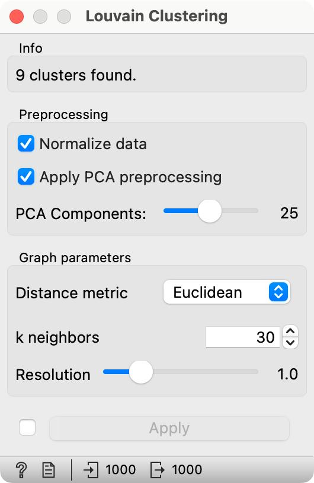
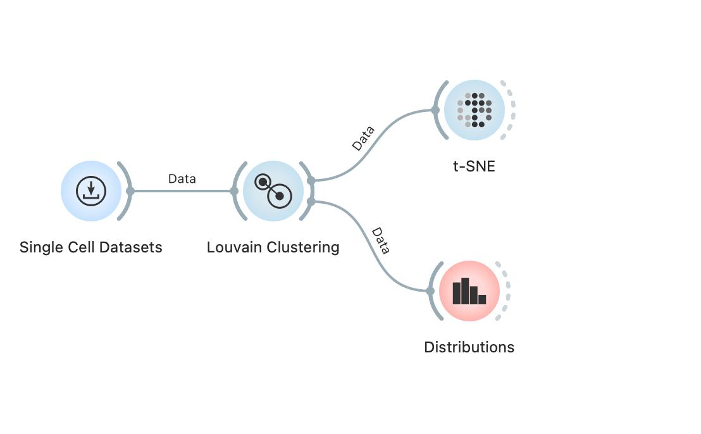
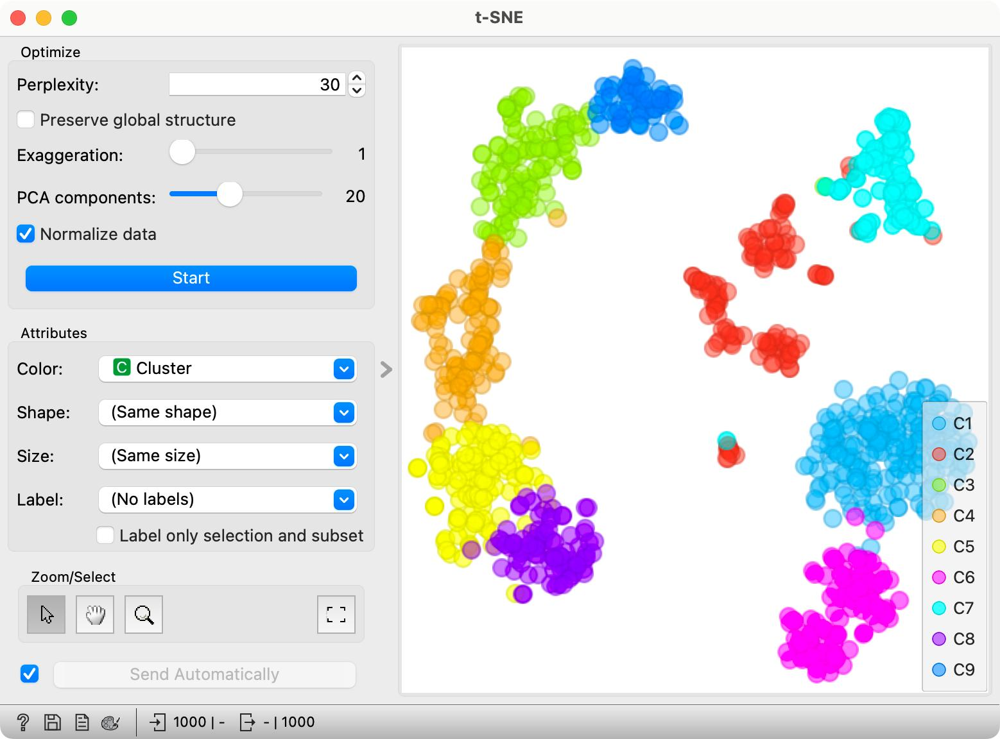
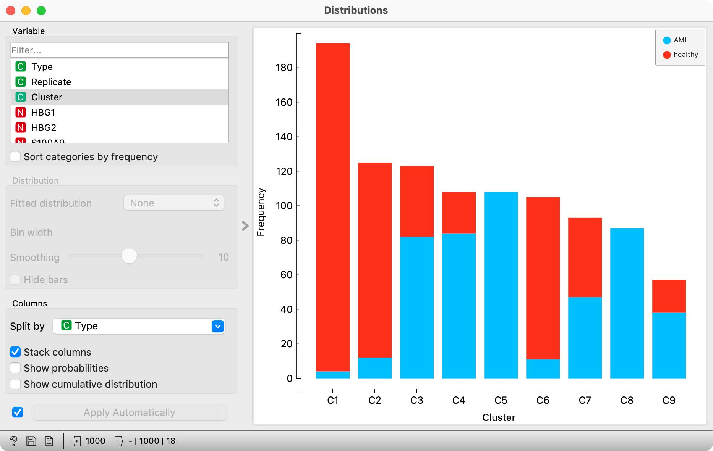
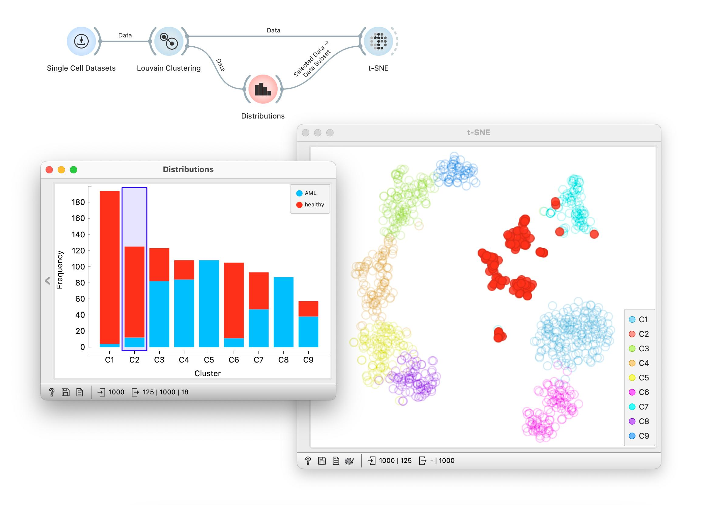

<!!! float-aside !!!>
We will again use a sample from Bone marrow mononuclear cells with AML with 1000 cells that contain 1000 most variable genes.

A typical task with a single cell data is to find clusters of cells. An advanced method that does this is Louvain clustering. Given the expression matrix, Louvain clustering creates a network of cells based on pairwise distances. Then, it searches for local communities — the parts of the network that are more strongly interconnected than expected by chance (think of friendships on social networks). Each local community is a cluster, and genes are assigned cluster labels accordingly.

<!!! float-aside !!!>
 
Louvain Clustering has a number of parameters. Here, we will stay with defaults, but you can experiment, change them and see the effect in t-SNE visualization.

In Orange, Louvain clustering is in its own widget that appends a column of cluster labels to the cell data. Quite neatly, the number of clusters is determined automatically. Let us construct a workflow that displays the results of the clustering in the t-SNE plot and that examines the frequency of the cells in each of the clusters. Let us observe the t-SNE plot first.

 

We have colored the points (cells) in t-SNE according to the cluster membership. Notice a nice separation of the clusters in the t-SNE plot. It looks like the cells are also well-separated in the original space of features (genes). A common mistake would be to compute the data projection first and then cluster the projected points. Obviously, then, the clusters would be separated perfectly and there would be no overlap.

 

We can now use Distributions widget to observe the frequency of the cells within each cluster.

 

Nice, the clusters are well represented and there is no need for any filtering at this stage. Notice also that some of the clusters mix healthy and diseased cells, and while this could be interesting, we will refrain to explore this aspect in this workshop. 

<!!! float-aside !!!>
Most visualizations in Orange are interactive. In Distributions, you can click on the on the bar to select the associated data. Try connecting Distribution to t-SNE widget to explore where are the regions in the embedding space of each cluster.

 

