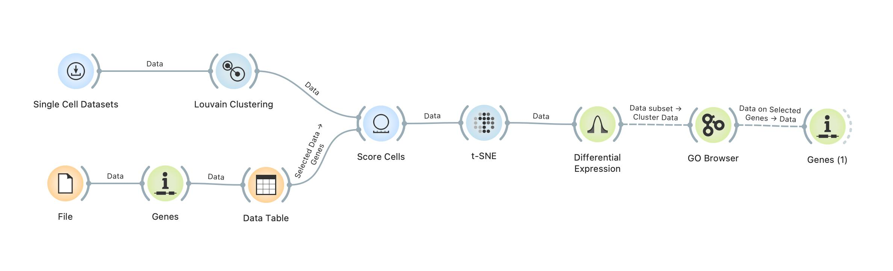
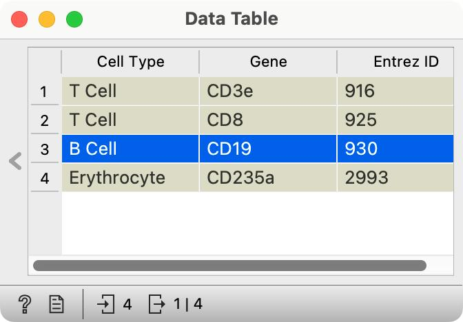
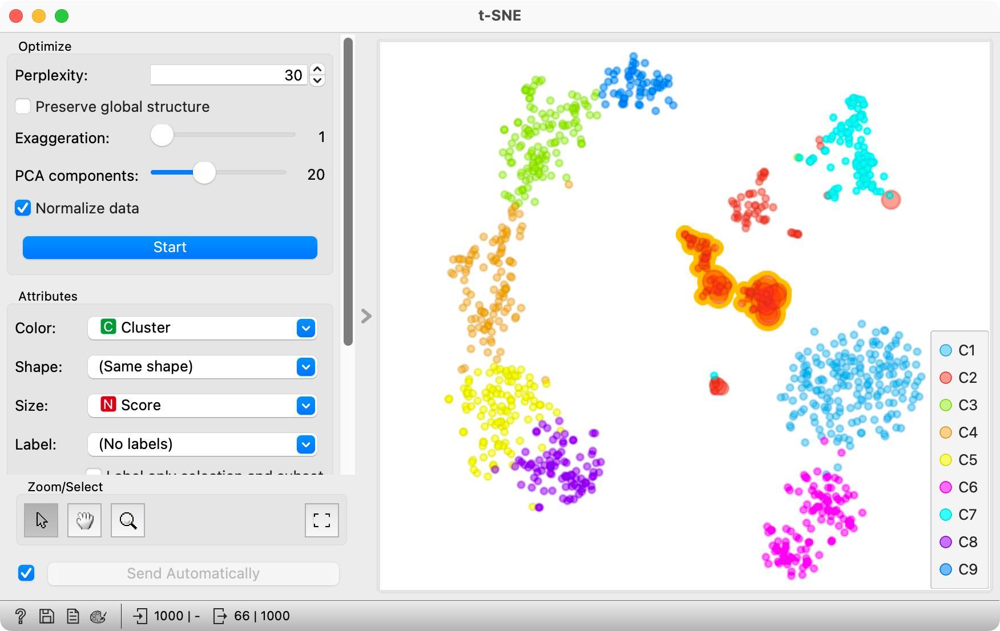
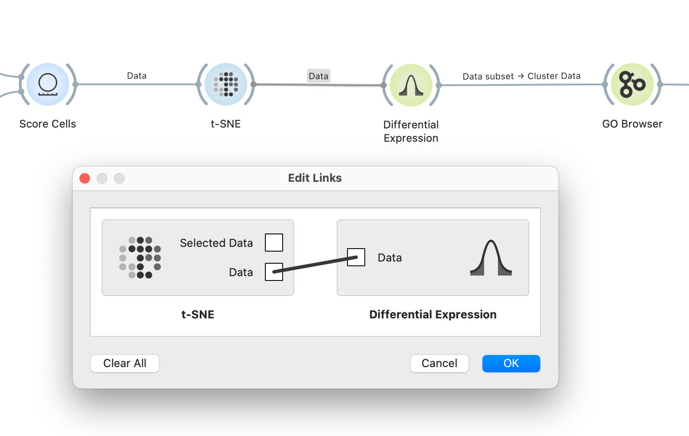
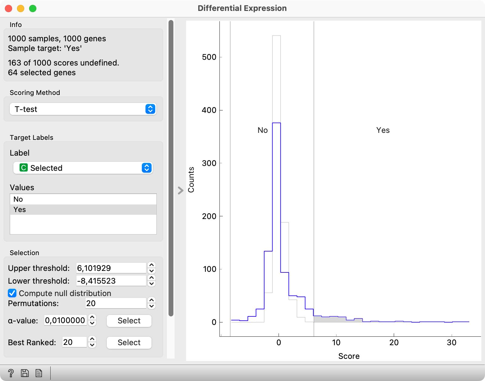
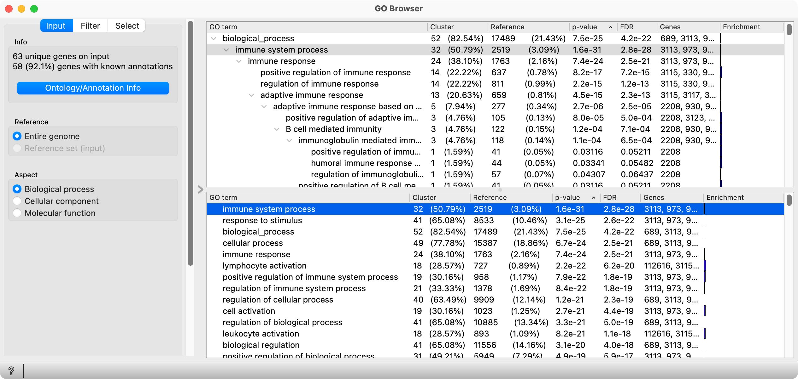
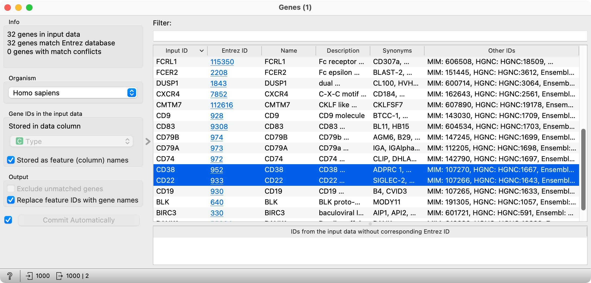

Here, we aim to discover “new” marker genes for B cells. We use quotes, of course, because it is likely that all markers for these cell types are already known. All we can do here is to rediscover some of them. The workflow we will use is our most complex one so far.

<!!! width-max !!!>
 

<!!! float-aside !!!>
 

We are already familiar with its part until t-SNE. In Data Table, we select one marker we have for B cells, CD19. Then, in t-SNE, we select a subset of cells of the red cluster in the center of the graph. 

 

We want to find genes that are expressed in the selected cells, but not expressed in all the other cells. We thus need to get all the data out from t-SNE, not just the selection and have a column that tells us if the cells were included in the selection. Whereas the default output of t-SNE is “Selected Data,” the output called Data of the t-SNE widget has all the data required, and we should rewire the connection.

<!!! float-aside !!!>
Double click on the connection between t-SNE and Differential Expression widget and instead of Selected Data, connect the Data channel of the t-SNE. 

 

Differential expression shows the distribution of the differences of gene expression in selected and all other cells. We have to set this widget properly. Set the scoring method to T-test,the Label to Selected, and marked that Yes is our target value. Differential Expression can also compare the observed distribution of changes to the null-distribution — the thin grey line — where data cells in each row are randomly permuted. Click on Compute null distribution to switch on the visualization of null-distribution.

<!!! float-aside !!!>
The distribution marked with grey line shows the null distribution, the distribution of genes scores under the arbitrary selection of target genes.

 

Differential Expression widget outputs the data with genes that are in extremes of the distribution. That is those, for which the difference in selected and non-selected cells is the largest. Genes that are most differentially expressed, lie on the left and on the right side of the two vertical splitters and their score value belongs to the shaded part of the distribution. Move the two vertical splitters such that there are only about 60 selected genes which are highly expressed in the selected group. 

So, where are the genes that are selected in the Differential Expression widget? In the output of the widget. We can observe the output dataset and analyze the set of selected genes with widgets that we connected to Differential Expression. Observe the data in the Data Table, a list of selected genes in Gene Info and the results of analysis of Gene Ontology term enrichment in GO Browser. From all these choices, our workflow shows only the GO Browser, but you are welcome to explore other widgets as well.

<!!! width-max !!!>
 

In GO Browser, we find that our differentially expressed genes are characteristically present in several Gene Ontology terms. That is, several GO terms are enriched with our selection of genes.

Interestingly, one of the most enriched terms is immune system process, with 34 genes from our differential expression set. Selecting this term, we get the data on these genes on the output of GO Browser, and we can check them out in the Genes widget.

<!!! width-max !!!>
 

Among the list of genes, there are also CD22 and CD38. “CD” stands for cluster of differentiation. Googling it, we find that two CD22 and CD38 are markers for B-cells. Oh, what a rediscovery! 