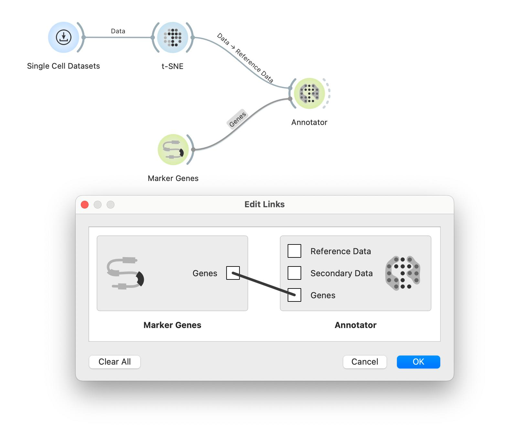
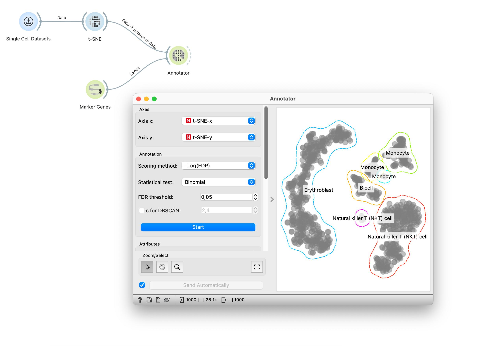

There is a neat widget in Orange that can analyze two-dimensional cell maps and can annotate the clusters in such visualizations. The widget is called Annotator, and it requires on the input the data set with two features that define the positions of the cells in twodimensional embedding, and a set of marker genes with associated cell type. We use the following workflow to get all these. We will again use the Bone marrow mononuclear cells with AML (sample dataset). 

<!!! float-aside !!!>
Some rewiring is required to get this workflow work right. Notice that t-SNE’s output channel is Data, and that Marker Genes output goes to Genes channel of the Annotator.

 

Marker Genes uses a large collection of markers from one of two open marker gene databases, Panglao or CellMarker. We want to select all the markers from the CellMarker database. The annotator will select the most expressed genes for each cell with the Mann-Whitney U test and compute the p-value of each cell types for a cell based on the selected statistical test. 

<!!! float-aside !!!>
Click on a marker and use the keyboard shortcut Command+A on Mac (or Ctrl+A on Windows) to select all. Move them to the right window.

<!!! retina !!!>
<ReplayImg src="orange-marker-genes1.gif" />

The Annotator has to be set to use t-SNE-x and t-SNE-y to position each cell, but once this is set, the display is cute and perhaps quite relevant.

<!!! width-max !!!>
 

It visualizes groups of cells and for each group, it shows few most present cell types.