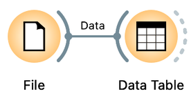
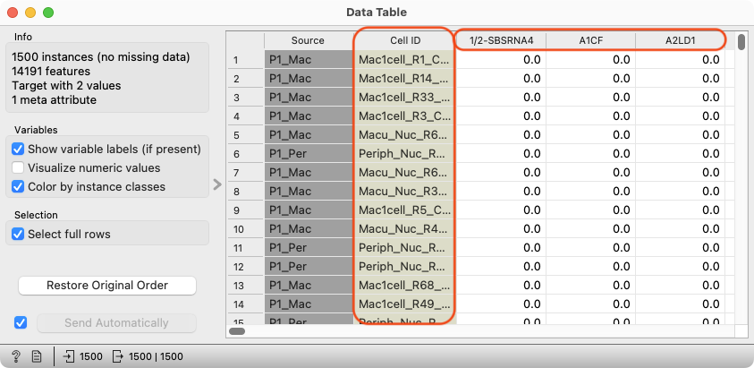
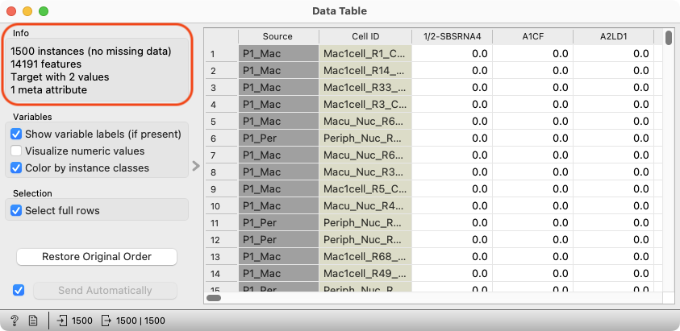
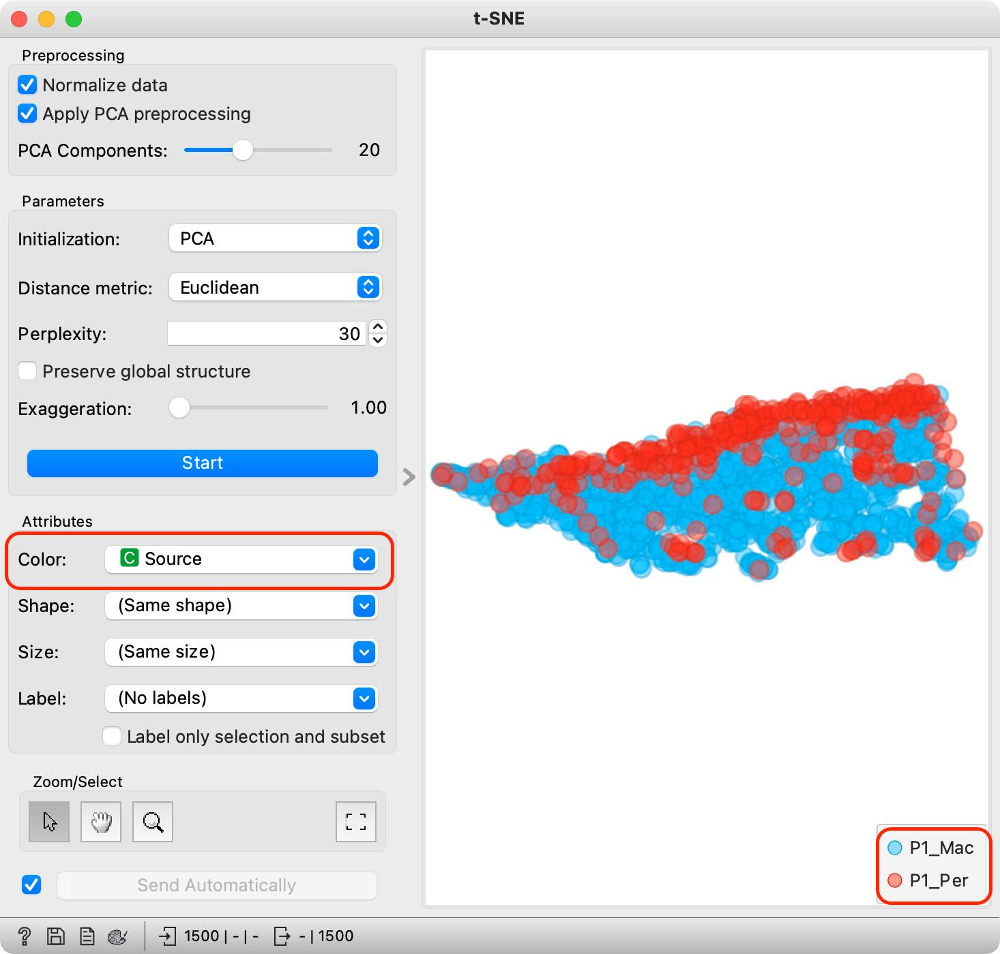

### Warmup Questions

<Question
  id="sc-warmup-1"
  points={1}
  type="multi"
  question="The representation of the expression of all the genes in a sample or in a single cell is called:"
  scorer={(answer) => answer.toLowerCase() === "expression profile"}
  options={["Expression Stamp", "Expression Profile"]}
  trials={2}
  timeout={10}
/>

<Question
  id="sc-warmup-2"
  points={1}
  type="multi"
  question="In single-cell expression studies we usually compare the average gene expressions between tissue samples."
  scorer={(answer) => answer.toLowerCase() === "false"}
  options={["True", "False"]}
  trials={2}
  timeout={10}
/>

<Question
  id="sc-warmup-3"
  points={1}
  type="multi"
  question="Single-cell datasets are high-dimensional and sparse."
  scorer={(answer) => answer.toLowerCase() === "true"}
  options={["True", "False"]}
  trials={2}
  timeout={10}
/>

### Download the quiz data

 Throughout the main part of this quiz you will be using a fraction of the data from [Liang et al.'s](https://pubmed.ncbi.nlm.nih.gov/31848347/) single-nuclei transcriptomic study (snRNA-seq) of the human retina. Using your newely acquired knowledge of single-cell analtyics you will try to replicate some of their analytical insights. 

Retinal tissue is composed of multiple cell types with distinct functions. The data contains samples from the **macular and peripheral region** of the retina from **a single healthy donor**. Sequence reads have already been aligned to the human genome, and the aligned reads were counted within exons. 

**Download the following data:**
1. The gene expression matrix [sc-quiz-sample1500.tab.gz](http://file.biolab.si/datasets/sc-quiz-sample1500.tab.gz)
2. Marker genes for cell types [sc-quiz-marker-genes.xlsx](http://file.biolab.si/datasets/sc-quiz-marker-genes.xlsx)

### Task 1 - Inspecting the expression matrix

First, use Orange's File widget to load the retinal single cell gene expression data ([sc-quiz-sample1500.tab.gz](http://file.biolab.si/datasets/sc-quiz-sample1500.tab.gz)) into Orange and view it in the Data Table widget. Answer the following questions.

<!!! retina !!!>

<Question
  id="sc-ex1-q1"
  points={1}
  type="multi"
  question="What do the rows of the expression matrix correspond to?"
  scorer={(answer) => answer === "cells"}
  options={["Cells", "Genes", "Cell source"]}
  neutralOptions={["I don't understand the question."]}
  trials={2}
  timeout={10}>
  <Explanation after="correctOrMaxTrials">

  We can load the dataset using the File widget. If we then open our dataset in the Data Table widget, we can see a metafeature for the Cell ID, indicating that each row represents one cell. Additionally, we can observe that the gene names are used as the column headers.

  <!!! retina !!!>
  

  </Explanation>
</Question>

<Question
  id="sc-ex1-q2"
  points={1}
  type="multi"
  question="How many genes characterize each cell in this dataset?"
  scorer={(answer) => answer === "more than 14000"}
  options={["1500", "14000", "More than 14000"]}
  neutralOptions={["I don't understand the question."]}
  trials={2}
  timeout={10}>
  <Explanation after="correctOrMaxTrials">

  In the top left corner of the Data Table widget you can find information on the number of instances (1500), in this case cells, as well as the number of features (14191), in this case genes. 

  <!!! retina !!!>
  

  </Explanation>
</Question>

<Question
  id="sc-ex1-q3"
  points={1}
  type="multi"
  question="Has this data been normalized?"
  scorer={(answer) => answer === "likely no"}
  options={["Likely no", "Likely yes", "There is no way for me to know"]}
  neutralOptions={["I don't understand the question."]}
  trials={2}
  timeout={10}>
  <Explanation after="correctOrMaxTrials">

  In raw (unprocessed) single-cell RNA sequencing data, we typically obtain whole numbers representing count data — specifically, the number of times a transcript was detected for a given gene in a given cell. In the case above, the data has most likely not been normalized, since the data values are comprised of either zeros or whole numbers that represent counts.
  </Explanation>
</Question>

### Task 2 - Dimensionality reduction and visualisation

<Question 
  id="sc-ex2-q4"  
  points={1}  
  type="multi"  
  question="What is the main goal of dimensionality reduction in single-cell analysis?"  
  scorer={(answer) => answer === "to simplify data while keeping important patterns and relationships."}  
  options={[  
    "To remove genes that are not expressed in all cells.",  
    "To simplify data while keeping important patterns and relationships.",  
    "To randomly reduce the number of genes in the dataset.",  
    "To increase the number of dimensions in the dataset for better visualization."  
  ]}  
  neutralOptions={["I don't understand the question."]}  
  trials={2}  
  timeout={10}>  
  <Explanation after="correctOrMaxTrials">
  </Explanation>
</Question>

<Question
  id="sc-ex1-q5"
  points={1}
  type="multi"
  question="Which statement best describes the difference between PCA and t-SNE in single-cell RNA sequencing analysis:"
  scorer={(answer) => answer === "t-sne is a nonlinear method that highlights local similarities between cells, whereas pca is a linear transformation that captures major sources of variance in gene expression."}
  options={["PCA is a nonlinear technique that emphasizes local clustering, while t-SNE preserves global variance in gene expression data.","t-SNE is a nonlinear method that highlights local similarities between cells, whereas PCA is a linear transformation that captures major sources of variance in gene expression.", "Both PCA and t-SNE generate identical visualizations of single-cell gene expression data.", "In single-cell analysis, PCA is preferred over t-SNE when identifying distinct cell clusters because it preserves the local structure of the data."]}
  neutralOptions={["I don't understand the question."]}
  trials={2}
  timeout={10}>
  <Explanation after="correctOrMaxTrials">
  </Explanation>
</Question>

Plot the data in a tSNE plot.

<Question
  id="sc-ex1-q6"
  points={1}
  type="multi"
  question="What do the two colours of the data points in the tSNE plot correspond to?"
  scorer={(answer) => answer === "the tissue from which a cell originates"}
  options={["The tissue from which a cell originates", "The donor from which a cell originates", "The sequencing technique used to obtain the data"]}
  neutralOptions={["I don't understand the question."]}
  trials={2}
  timeout={10}>
  <Explanation after="correctOrMaxTrials">
  The two colors of the data points in the t-SNE plot represent the source of the cells, which in this case corresponds to their tissue origin — either from the macular or peripheral region of the retina. 

    <!!! retina !!!>
  
  </Explanation>
</Question>

