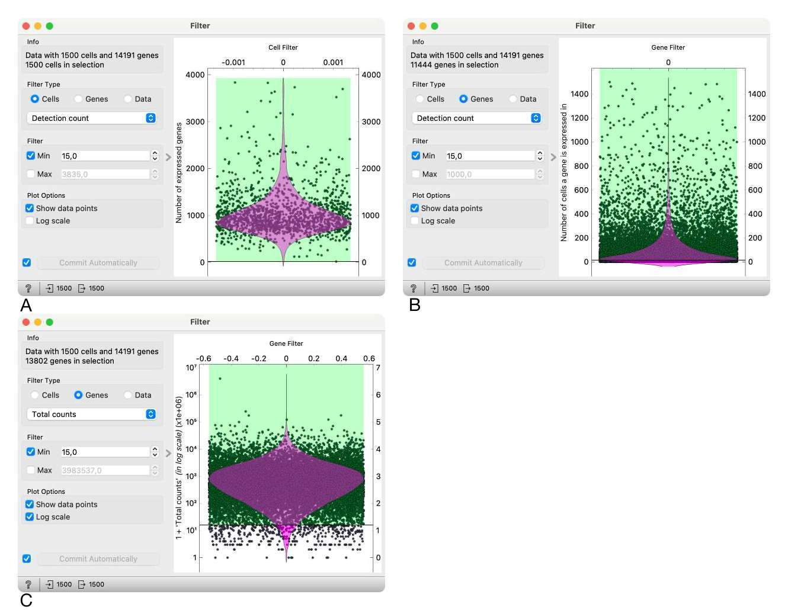
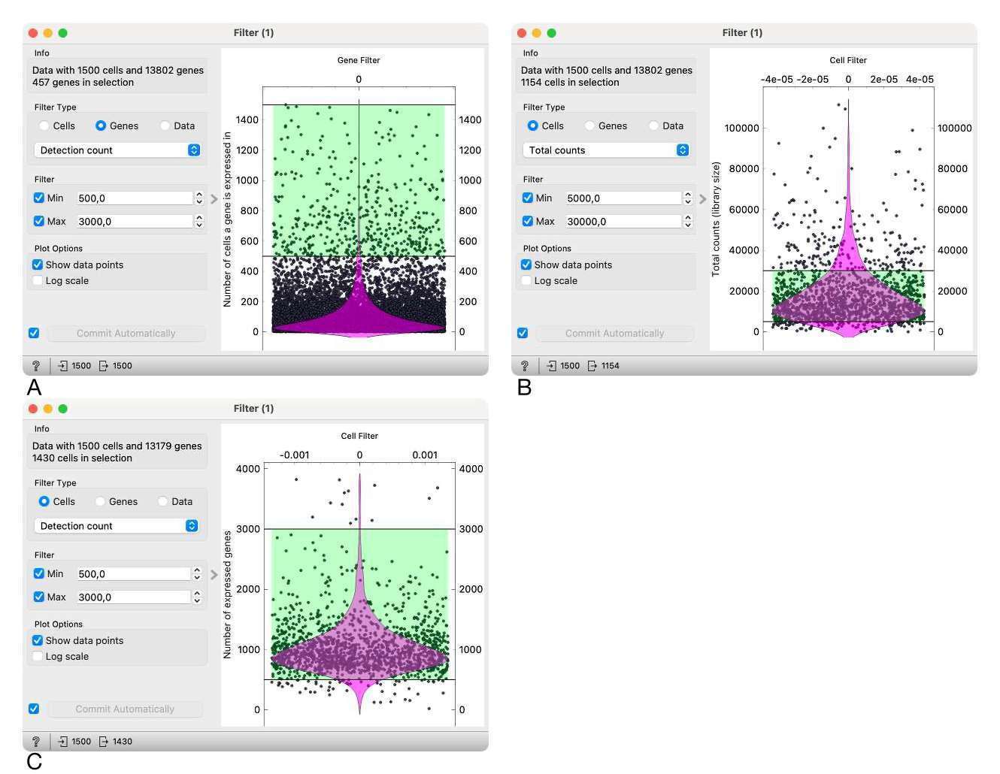
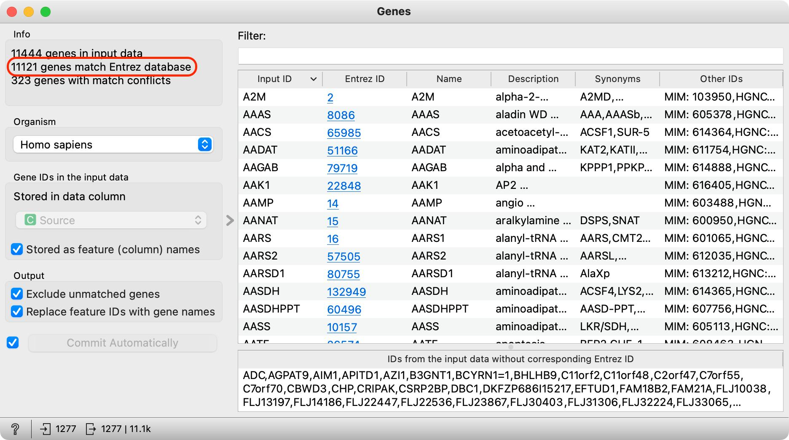
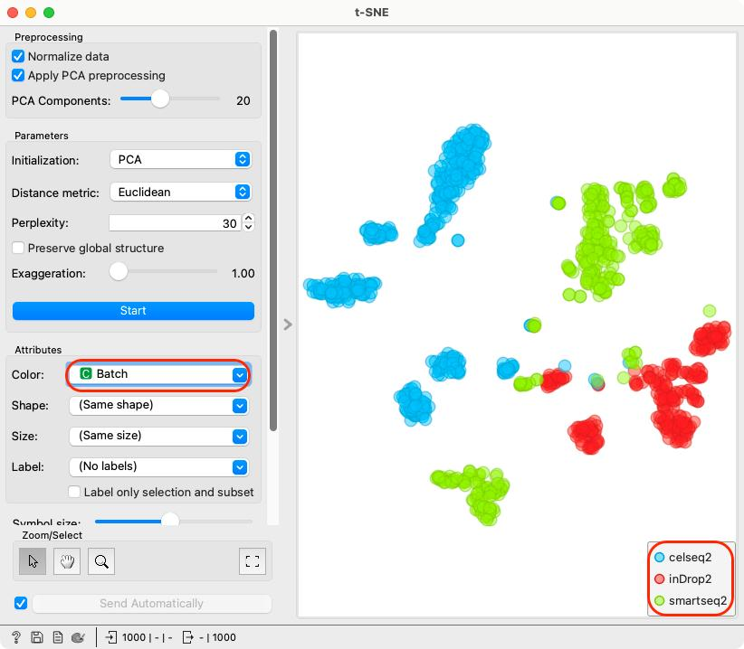
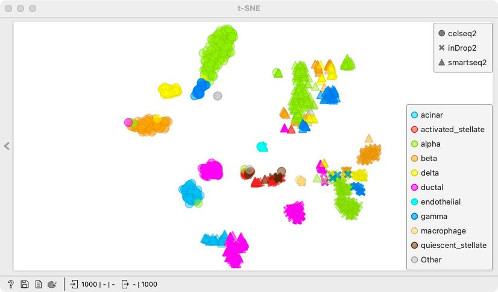
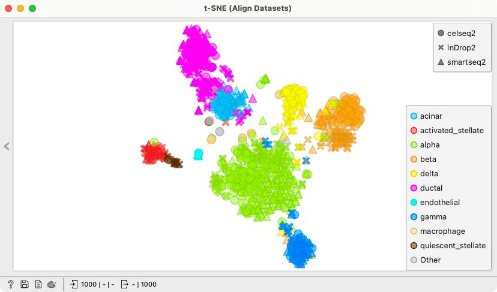
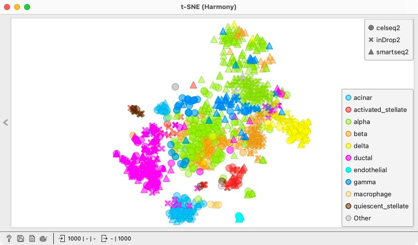
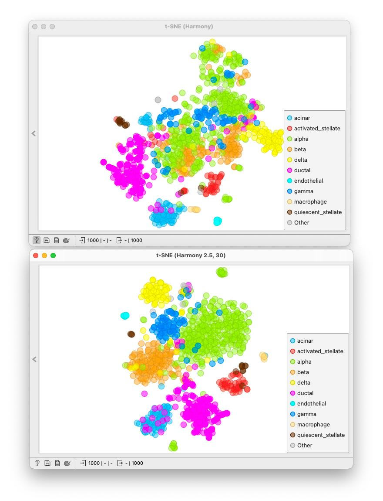
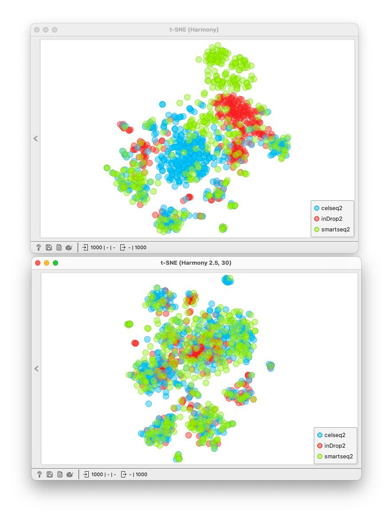

### Task 1 - Quality control 

Perform quality control on the [expression matrix](http://file.biolab.si/datasets/sc-quiz-sample1500.tab.gz) of the retinal dataset from the study by Liang et al. (2019).

a) Discard genes that were not detected in at least 1% of all cells.

<Question
  id="sc-ex2-q1"
  points={1}
  type="multi"
  question="Which of the following is the correct filter setting for performing a)?"
  scorer={(answer) => answer === "b"}
  options={["A", "B", "C"]}
  neutralOptions={["I don't understand the question."]}
  trials={2}
  timeout={10}>
  <Explanation after="correctOrMaxTrials">
  Since we want to filter out genes we have to set the Filter Type to Genes. Furthermore, we are interested only whether or not the gene was detected and not the quantity of the expressed gene, we choose to filter by Detection count.
  </Explanation>
</Question>

<!!! width-max !!!>

<Question
  id="sc-ex2-q2"
  points={1}
  type="multi"
  question="What is the primary reason for filtering genes before further analysis?"
  scorer={(answer) => answer === "to remove uninformative genes that are never expressed or expressed in too few cells."}
  options={[
    "To remove uninformative genes that are never expressed or expressed in too few cells.",
    "To ensure that every gene is expressed in at least half of the cells.",
    "To reduce the number of samples in the dataset.",
    "To improve batch effect correction."
  ]}
  neutralOptions={["I don't understand the question."]}
  trials={2}
  timeout={10}>
</Question>

b) Filter cells based on a minimum number of 500 and a maximum number of 3000 expressed genes per cell.

<Question
  id="sc-ex2-q3"
  points={1}
  type="multi"
  question="Which of the following is the correct filter setting for performing b)?"
  scorer={(answer) => answer === "c"}
  options={["A", "B", "C"]}
  neutralOptions={["I don't understand the question."]}
  trials={2}
  timeout={10}>
  <Explanation after="correctOrMaxTrials">
  Since we want to filter out cells we have to set the Filter Type to Cells. Furthermore, we are interested in the **number** of expressed genes per cell not in the total amount of transcripts per cell - so we again choose to filter by Detection count.
  </Explanation>
</Question>

<!!! width-max !!!>

<Question
  id="sc-ex2-q4"
  points={1}
  type="multi"
  question="Why do we filter out cells with extremely high or low gene expression counts?"
  scorer={(answer) => answer === "all of the above"}
  options={[
    "Cells with very few detected genes may be damaged or of low quality",
    "Cells with an unusually high number of expressed genes may be multiplets or artifacts",
    "Removing extreme cells improves the accuracy of downstream clustering and visualization",
    "All of the above"
  ]}
  neutralOptions={["I don't understand the question."]}
  trials={2}
  timeout={10}>
</Question>

c) Filter cells based on a minimum number of 6000 and a maximum number of 80000 transcripts per cell.

<Question
  id="sc-ex2-q5"
  points={1}
  type="multi"
  question="What do the points on the graph in the Filter widget represent in this third filtering step?"
  scorer={(answer) => answer === "cells"}
  options={["Genes", "Cells", "Transcripts"]}
  neutralOptions={["I don't understand the question."]}
  trials={2}
  timeout={10}>
  <Explanation after="correctOrMaxTrials">
  Since we are again filtering out cells we have to set the Filter Type to Cells. This means that the points on the graph represent cells (the threshold marks which cells are going to be excluded from (or included in) further analysis).
  </Explanation>
</Question>

### Task 2 - Normalization and scaling

Normalize expression values for each gene in each cell to counts per 10000, logarithmize the values with natural logarithm and perform standardization with the Single Cell Preprocess widget.

<Question
  id="sc-ex2-q6"
  points={1}
  type="multi"
  question="Why do we need to normalize the gene expression values in single-cell analysis?"
  scorer={(answer) => answer === "to account for sequencing depth and make gene expression values comparable across cells"}
  options={["To eliminate biological variation between different cell types", "To account for sequencing depth and make gene expression values comparable across cells", "To change gene expression values so that all genes have the same expression level", "Normalization is only needed for datasets with a small number of cells"]}
  neutralOptions={["I don't understand the question."]}
  trials={2}
  timeout={10}>
  <Explanation after="correctOrMaxTrials">
  Raw gene expression values are influenced by technical factors such as sequencing depth. Normalization adjusts for these differences, allowing for meaningful comparisons of gene expression across cells.
  </Explanation>
</Question>

### Task 3 - Gene annotation

Map the genes in the dataset to the Entrez database.

<Question
  id="sc-ex2-q7"
  points={1}
  type="multi"
  question="How many genes were matched to the Entrez database?"
  scorer={(answer) => answer === "approximately 11000"}
  options={["Approximately 300", "Approximately 14000", "Approximately 11000"]}
  neutralOptions={["I don't understand the question."]}
  trials={2}
  timeout={10}>
  <Explanation after="correctOrMaxTrials">
  <!!! retina !!!>
  
  </Explanation>
</Question>

Plot the preprocessed and annotated data in a new t-SNE plot and compare it to the previous one. Quite the difference!

### Task 4 - Batch Effect Correction

Download the sample of a pancreas single cell gene expression dataset ([pancreas_sampled_1k5k.tab](http://file.biolab.si/datasets/pancreas_sampled_1k5k.tab)) and load it into Orange. Generate a t-SNE plot. 

<Question
  id="sc-ex2-q8"
  points={1}
  type="multi"
  question="How many different batches are present in the dataset?"
  scorer={(answer) => answer === "3"}
  options={["11", "2", "3"]}
  neutralOptions={["I don't understand the question."]}
  trials={2}
  timeout={10}>
  <Explanation after="correctOrMaxTrials">

  <!!! retina !!!>
  
  </Explanation>
</Question>

<Question
  id="sc-ex2-q9"
  points={1}
  type="multi"
  question="Why do we need to apply batch-correction?"
  scorer={(answer) => answer === "to align datasets from different sources"}
  options={["To normalize the data", "To align datasets from different sources", "To reduce the size of the dataset", "To separate datasets from different sources"]}
  neutralOptions={["I don't understand the question."]}
  trials={2}
  timeout={10}>
</Question>

**Apply two different batch-effect correction methods to the dataset:**

a) Using Align Datasets widget (set the Data source indicator to Batch and leave all other parameters at default values)

b) Using Harmony widget (leave all parameters at their default values)

**For each method, generate a t-SNE embedding of the corrected data. Compare t-SNE plots (uncorrected, Align Datasets corrected, Harmony corrected) side by side.**

<Question
  id="sc-ex2-q10"
  points={1}
  type="multi"
  question="Just by looking at the t-SNE plots, which method more effectively removes batch effects (i.e., shows better mixing of batches and separation of cell type clusters)?"
  scorer={(answer) => answer === "align datasets"}
  options={["Harmony", "Neither removed any batch effects", "Align Datasets", "Both produce the same plot"]}
  neutralOptions={["I don't understand the question."]}
  trials={2}
  timeout={10}>
  <Explanation after="correctOrMaxTrials">
  The t-SNE plot produced by Align Datasets shows the most effective batch correction. When colored by cell type, it displays well-defined and clearly separated clusters, indicating preservation of biological structure. At the same time, when colored by batch, the cells are well mixed across clusters, showing that batch effects have been successfully removed.
  <!!! retina !!!>
  
  
  
  </Explanation>
</Question>

Start from the uncorrected dataset and create a second Harmony workflow: add a new Harmony widget, set the parameter theta to 2.5, and leave all other parameters at their default values. Connect the output of this widget to a new t-SNE plot and set the number of PC components used to 30.

Compare this plot with the previous t-SNE plot obtained using Harmony with default parameters. Focus on how the change in theta affects the mixing of batches and the separation of clusters.

<Question
  id="sc-ex2-q11"
  points={1}
  type="multi"
  question="Compared to the default Harmony settings, does increasing theta to 2.5 and using 30 principal components improve batch mixing and cluster separation?"
  scorer={(answer) => answer === "yes, both are improved"}
  options={[
    "Yes, both are improved",
    "No, there is no noticeable improvement in either",
    "Batch mixing improves, but cluster separation becomes worse"
  ]}
  neutralOptions={["I don't understand the question."]}
  trials={2}
  timeout={10}>
  <Explanation after="correctOrMaxTrials">
  <!!! retina !!!>
  The t-SNE plot obtained using **theta = 2.5** and **30 principal components** shows improved results compared to the default Harmony settings. Cells from different batches are better mixed, indicating more effective removal of batch effects. At the same time, clusters corresponding to cell types are more clearly separated, showing improved preservation of biological structure.
  
  
  </Explanation>
</Question>
