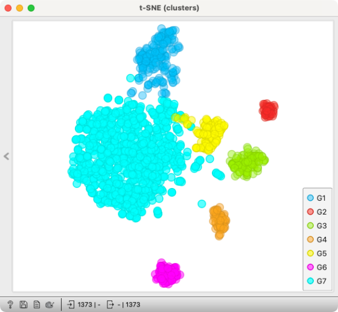

### Task 1 - Identifying clusters

Above you can see a t-SNE plot of the retinal dataset showing expected clusters (the number of PCA components in the t-SNE widget set to 10). Identify the most likely cell type corresponding to each cluster. Use the data table of known marker genes for each cell type and set the aggregation parameter in the Score Cells widget to **Fraction of expressed markers**. 

<Question
  id="sc-ex3-q1"
  points={1}
  type="multi"
  question="Which cluster on the plot above most likely corresponds to cone cells?"
  scorer={(answer) => answer === "pink"}
  options={["Orange", "Pink", "Yellow", "Red"]}
  neutralOptions={["I don't understand the question."]}
  trials={2}
  timeout={10}>
</Question>

<Question
  id="sc-ex3-q2"
  points={1}
  type="multi"
  question="Which cluster on the plot above most likely corresponds to retinal ganglion cells?"
  scorer={(answer) => answer === "red"}
  options={["Red", "Light Blue", "Green", "Pink"]}
  neutralOptions={["I don't understand the question."]}
  trials={2}
  timeout={10}>
</Question>

Liang et al. report that in the peripheral tissue the proportion of rods is higher than the proportion of rods in the macular tissue. Does this hold for our dataset sample? Try using the Distributions widget to figure this out. 

<Question
  id="sc-ex3-q3"
  points={1}
  type="multi"
  question="In our sample, the proportion of rods is higher in the peripheral tissue than the proportion of rods in the macular tissue:"
  scorer={(answer) => answer === "true"}
  options={["True", "False"]}
  neutralOptions={["I don't understand the question."]}
  trials={1}
  timeout={10}>
</Question>

Select the top 100 genes that are differentially expressed in cones in comparison to non-cones (T-test). Forward them to the GO widget. Sort the lower list by increasing p-value.

<Question
  id="sc-ex3-q4"
  points={1}
  type="multi"
  question="Which among these GO terms have a high p-value and have an enrichment score above 40?"
  scorer={(answer) => answer === "visual perception, sensory perception of light stimulus, detection of light stimulus"}
  options={["Visual perception, Sensory perception of light stimulus, Detection of light stimulus", "Signal transduction, Nervous system proces, Sensory perception", "Detection of abiotic stimulus, Detection of external stimulus, Sensory perception"]}
  neutralOptions={["I don't understand the question."]}
  trials={2}
  timeout={10}>
</Question>

Try to determine [the tissue source of the single-cell dataset from a human ](https://file.biolab.si/tmp/sc-quiz-anonymous-sample.tab). (Try using Marker Genes widget, Annotator and, if need be, a quick web search)

<Question
  id="sc-ex3-q5"
  points={1}
  type="multi"
  question="From which organ tissue do the cells from the dataset most likely come from?"
  scorer={(answer) => answer === "pancreas"}
  options={["Eye", "Kidney", "Pancreas", "Heart"]}
  neutralOptions={["I don't understand the question."]}
  trials={2}
  timeout={10}>
</Question>

