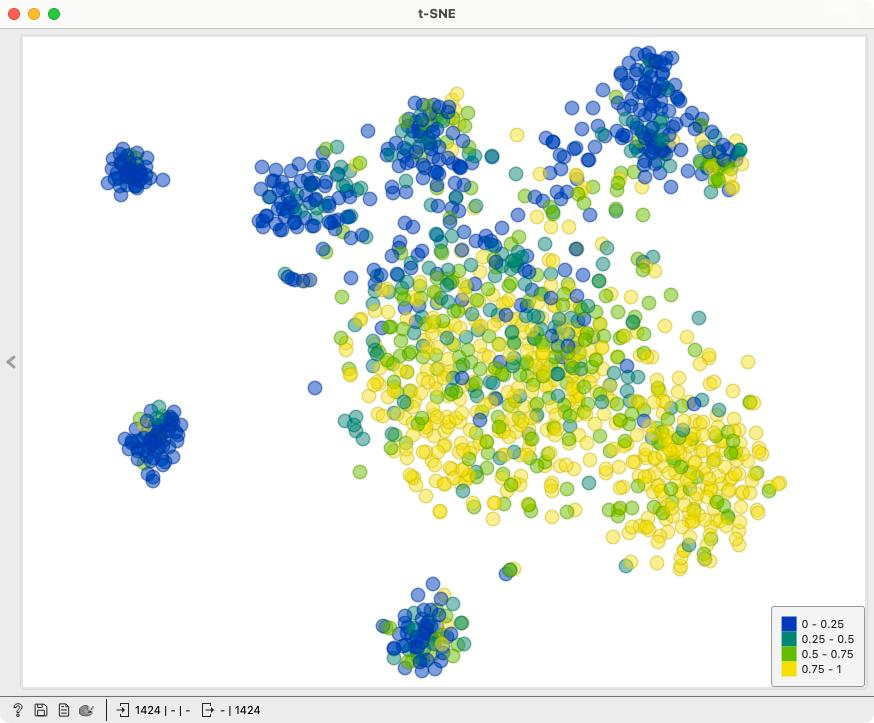
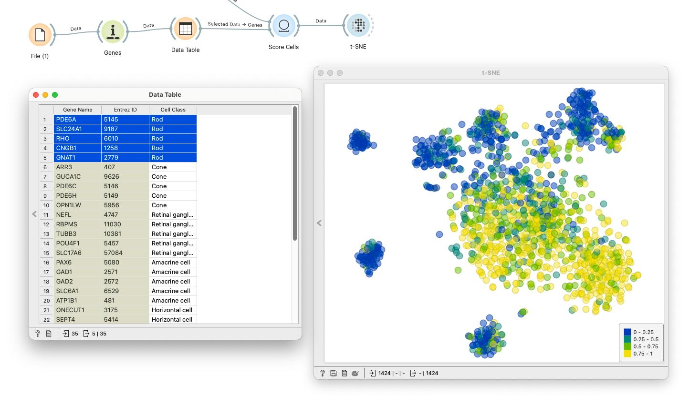
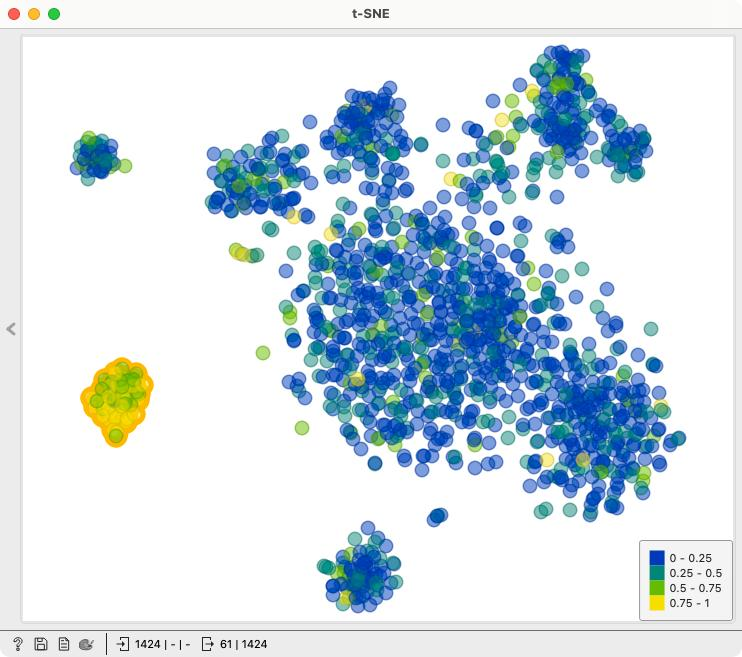
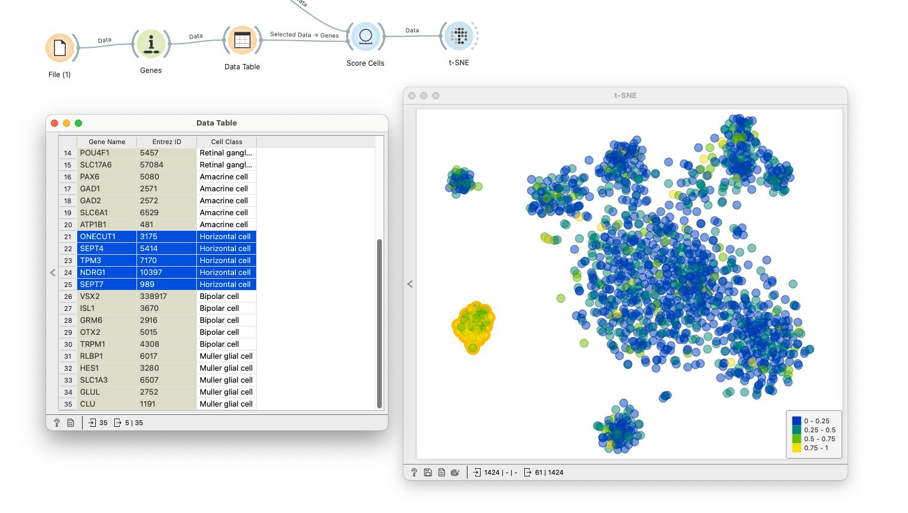
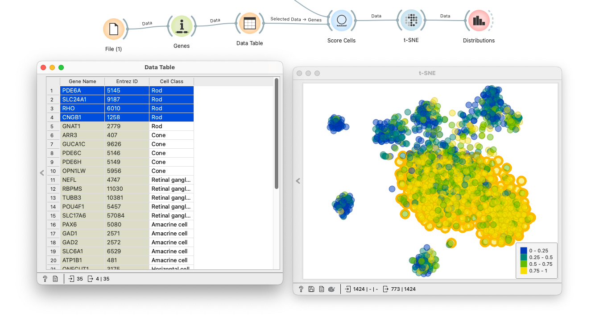
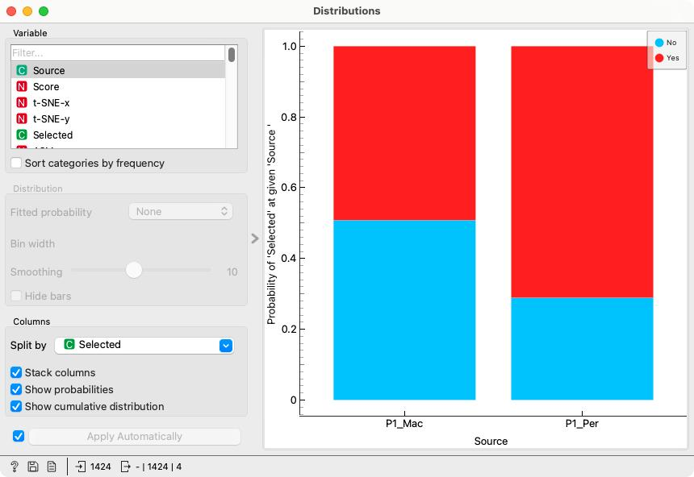

### Task 1 - Identifying clusters

<Question
  id="sc-ex3-q1"
  points={1}
  type="multi"
  question="What are marker genes?"
  scorer={(answer) => answer === "genes whose expression is characteristic of specific cell types or states"}
  options={[
    "Genes whose expression is characteristic of specific cell types or states",
    "Genes that are expressed in all cells at the same level",
    "Genes used to normalize gene expression data",
    "Genes consistently expressed in most or all cells because they are required for basic cellular functions necessary for survival"
  ]}
  neutralOptions={["I don't understand the question."]}
  trials={2}
  timeout={10}>
</Question>

Perform cluster exploration on the retinal dataset. Use the data table of known marker genes ([sc-quiz-marker-genes.xlsx](http://file.biolab.si/datasets/sc-quiz-marker-genes.xlsx)) for each cell type (don't forget to pass the marker genes data though the Genes widget to annotate!) and set the aggregation parameter in the Score Cells widget to **Fraction of expressed markers**. 

<Question
  id="sc-ex3-q2"
  points={1}
  type="multi"
  question="Which cell type is likely picked out in the t-SNE plot above?"
  scorer={(answer) => answer === "rods"}
  options={["Cones", "Horizontal cells", "Retinal ganglion cells", "Rods", "Amacrine cells"]}
  neutralOptions={["I don't understand the question."]}
  trials={4}
  timeout={10}>
    <Explanation after="correctOrMaxTrials">
    <!!! retina !!!>
    
    </Explanation>
</Question>

<Question
  id="sc-ex3-q3"
  points={1}
  type="multi"
  question="Which cell type is likely picked out in the t-SNE plot above?"
  scorer={(answer) => answer === "horizontal cells"}
  options={["Cones", "Horizontal cells", "Retinal ganglion cells", "Rods", "Amacrine cells"]}
  neutralOptions={["I don't understand the question."]}
  trials={4}
  timeout={10}>
    <Explanation after="correctOrMaxTrials">
    <!!! retina !!!>
    
    </Explanation>
</Question>

Liang et al. report that in the peripheral tissue the proportion of rods in comparison to other cell types is higher than the proportion of rods in comparison to other cells in the macular tissue. Does this hold for our dataset sample? Try using the Distributions widget to figure this out.

<!!! float-aside !!!>
(This is a hard question, so here is a hint: In the Distributions widget you need to differentiate between Rods (Selected) and non-Rods (Not Selected) (this means sending all data to Distributions, not just the selected data - rewire!) as well as between tissue Source (Macular or Peripheral). In addition, check _Stack columns_, _Show probabilities_ and _Show cummulative distribution_)

<Question
  id="sc-ex3-q4"
  points={1}
  type="multi"
  question="In our sample, the proportion of rods is higher in the peripheral tissue than the proportion of rods in the macular tissue:"
  scorer={(answer) => answer === "true"}
  options={["True", "False"]}
  neutralOptions={["I don't understand the question."]}
  trials={1}
  timeout={10}>
    <Explanation after="correctOrMaxTrials">
    <!!! retina !!!>
    
    
    </Explanation>
</Question>

Select the top 100 genes that are differentially expressed in cones in comparison to non-cones (T-test). Forward them to the GO widget. Sort the lower list by increasing p-value.

<Question
  id="sc-ex3-q5"
  points={1}
  type="multi"
  question="Which among these GO terms have a high p-value and have an enrichment score above 40?"
  scorer={(answer) => answer === "visual perception, sensory perception of light stimulus, detection of light stimulus"}
  options={["Visual perception, Sensory perception of light stimulus, Detection of light stimulus", "Signal transduction, Nervous system proces, Sensory perception", "Detection of abiotic stimulus, Detection of external stimulus, Sensory perception"]}
  neutralOptions={["I don't understand the question."]}
  trials={2}
  timeout={10}>
</Question>

Try to determine [the tissue source of the single-cell dataset from a human ](https://file.biolab.si/tmp/sc-quiz-anonymous-sample.tab). (Try using Marker Genes widget, Annotator and, if need be, a quick web search)

<Question
  id="sc-ex3-q6"
  points={1}
  type="multi"
  question="From which organ tissue do the cells from the dataset most likely come from?"
  scorer={(answer) => answer === "pancreas"}
  options={["Eye", "Kidney", "Pancreas", "Heart"]}
  neutralOptions={["I don't understand the question."]}
  trials={2}
  timeout={10}>
</Question>

