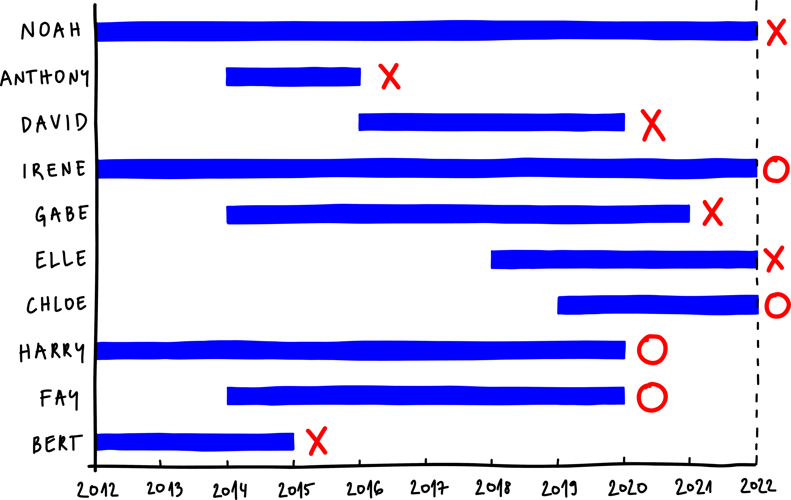
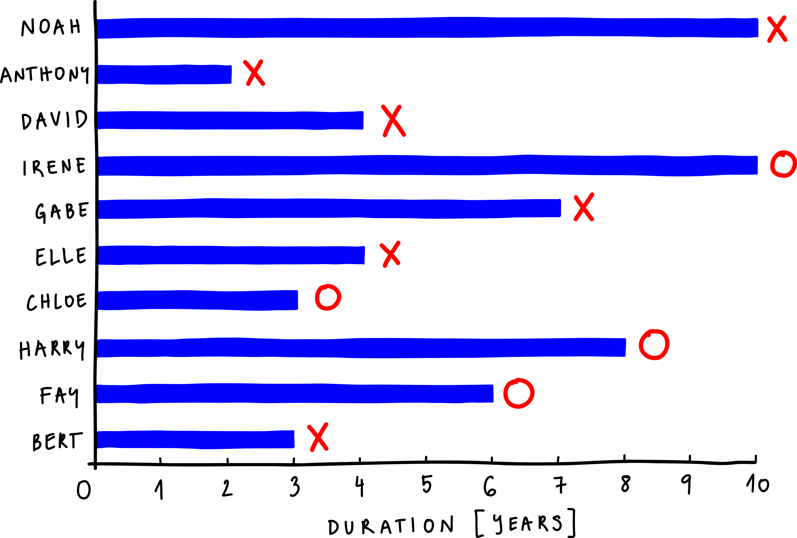
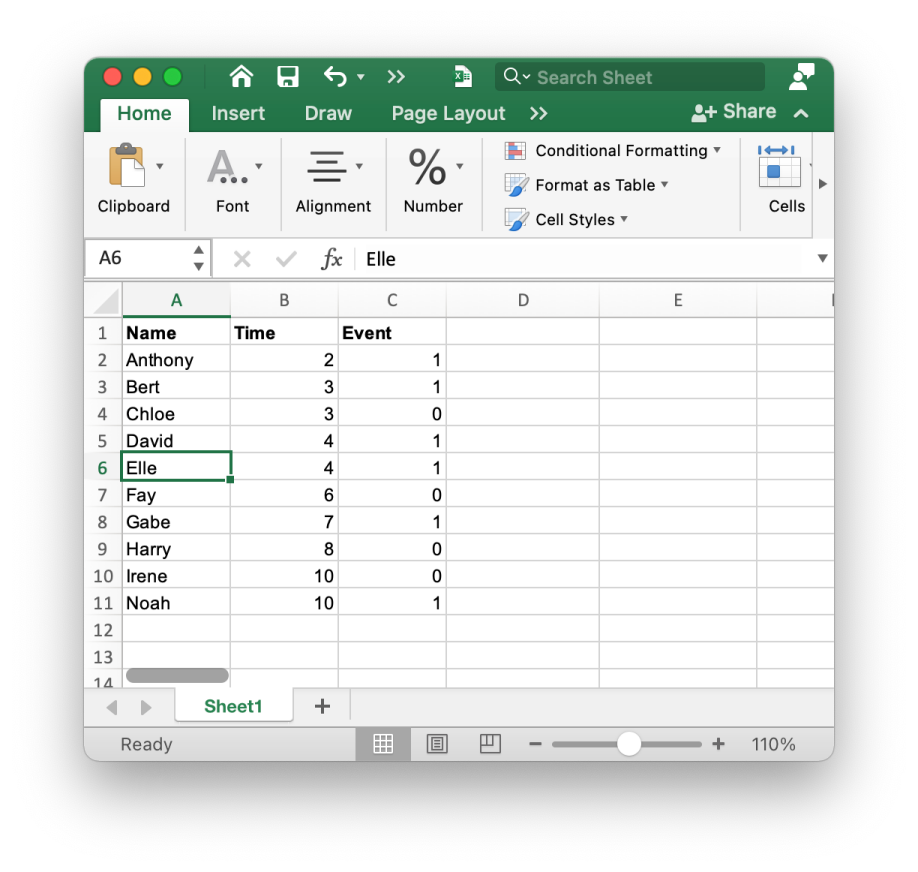

<!!! float-aside !!!>
Survival analysis is a set of techniques used for modeling time to an event of interest.

In survival analysis, the primary outcome we are interested in is the **time to an event of interest**. The "survival" in survival analysis stems from its use in the study of the survival of patients. However, the event of interest can be many things: a disease relapse, the first technical failure of a car, or something as simple as the time until a newly acquired dental filling falls out. Many analysis methods would apply if the event occurred in all individuals. However, it is usual that at the end of a study, some individuals have yet to have the event of interest, and some might have ended their participation in the study beforehand for reasons other than experiencing the event. This doesn't mean that they won't necessarily experience the event in the future, but that their actual time to the event is unknown. This phenomenon is called **censoring**, and the data with an unknown true time to event is called **censored data**. Survival analysis includes a set of methods that can deal with datasets that include censored data. 

<!!! float-aside !!!>
Data with an unknown true time to event is called censored data.

Let's look at the example from the videolecture. We gathered from a group of 10 friends when they last got a dental filling in the last ten years and when it fell out if it did. Can we estimate the probability of a new dental filling remaining in place after five years?

Below we plotted the answers as a diagram. The x-axis marks the time from 2012 to 2022, and the lines represent when each person got their dental filling and how long it lasted. For instance, Bert got a dental filling in 2012, which lasted until 2015, and Fay got her's in 2014, which lasted until 2020. We have marked the friends whose dental filling fell out with a cross. However, two of the participants in this small study, Irene and Chloe, had their dental filling in place at the end of our observation window. And Harry and Fay did not lose their dental fillings, but for some reason or another, we do not know what happened to their dental fillings from 2020 to 2022. Perhaps they got them changed before the fillings had the chance to fall out. These four participants represent our censored data points. The time their dental fillings stayed in place still tells us something about how long fillings usually last. So instead of discarding their data, we mark them with a circle.

This data represents an example of right censoring, but we also know cases with left- and interval censoring. Left-censoring would mean that we observe the presence of a state or condition but do not know when it began. Interval censoring, on the other hand, means that individuals come in and out of observation. This tutorial focuses only on right-censoring since this is how most survival data is censored.

A minimal survival dataset is thus composed of observations with a survival time and event variable. The latter specifies if the event has, in fact, occurred (event=1) or whether it has been censored (event=0). We can transform our dental fillings data plotted as a diagram into a data table suitable for survival analysis. Since we are interested in how much time the dental filling lasted and not exactly what year it fell out, we re-plot the diagram, aligning when each person got their cavity filled to time 0.

We can now easily transform this diagram into a data table. We order the data instances by time so that Anthony - whose time to his filling falling out is the shortest - is first, Bert is second, followed by Chloe, and so on. The third column contains the data on event censoring. On the diagram, we've marked Anthony and Bert with a cross, which means their filling fell out. Under their names in the table, we input a 1. But Chloe is marked with a circle since her filling has yet to fall out by the end of 2022, so we input a 0. We do the same for others. We have successfully prepared the data for the application of survival analysis methods.

