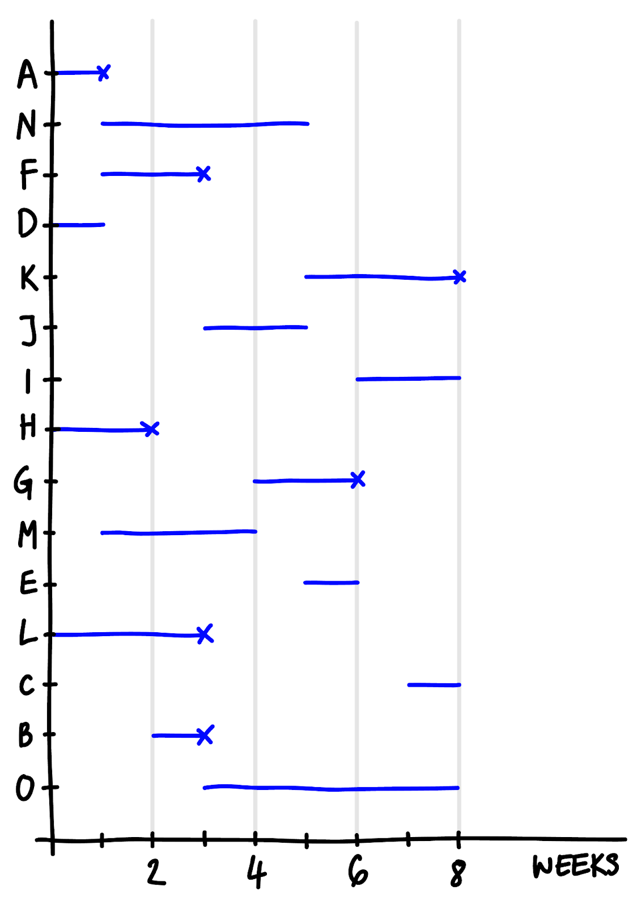
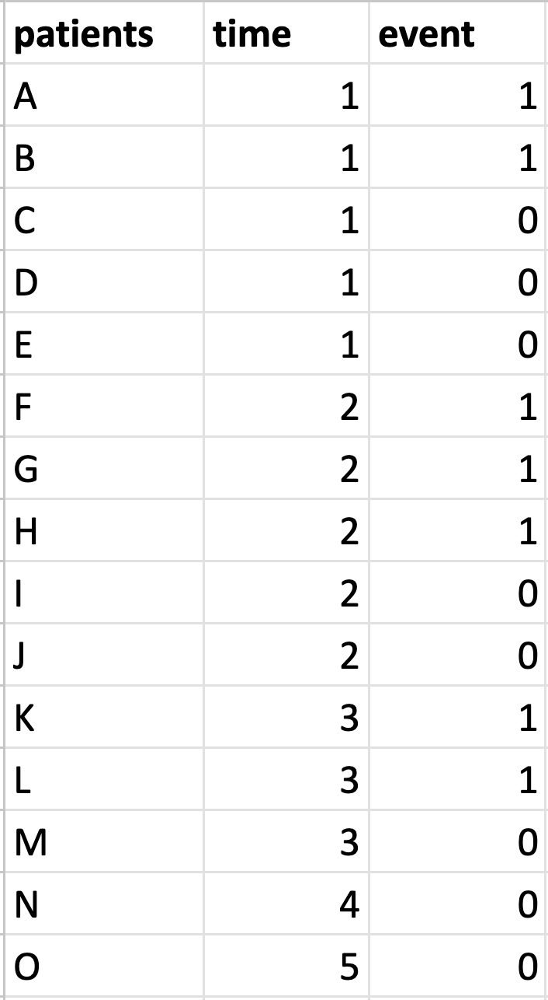
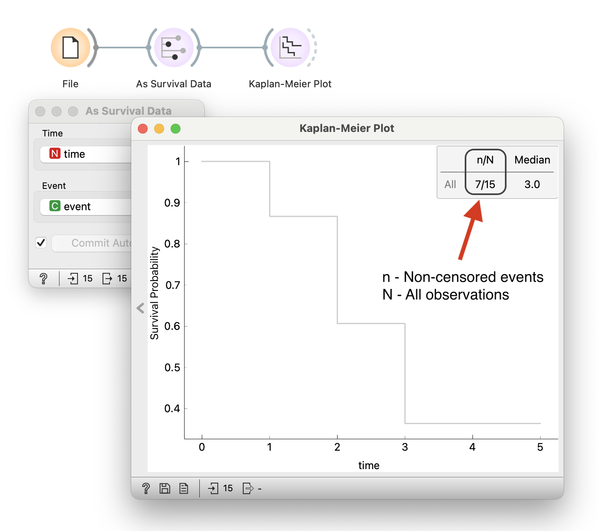
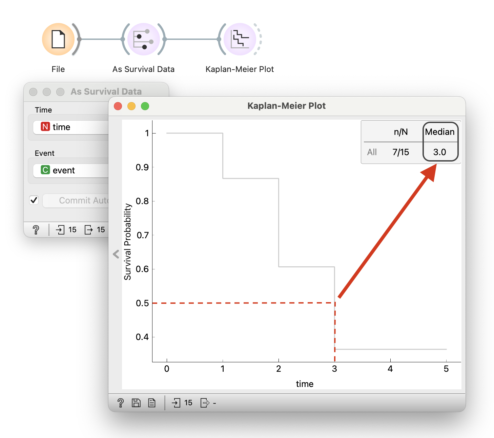
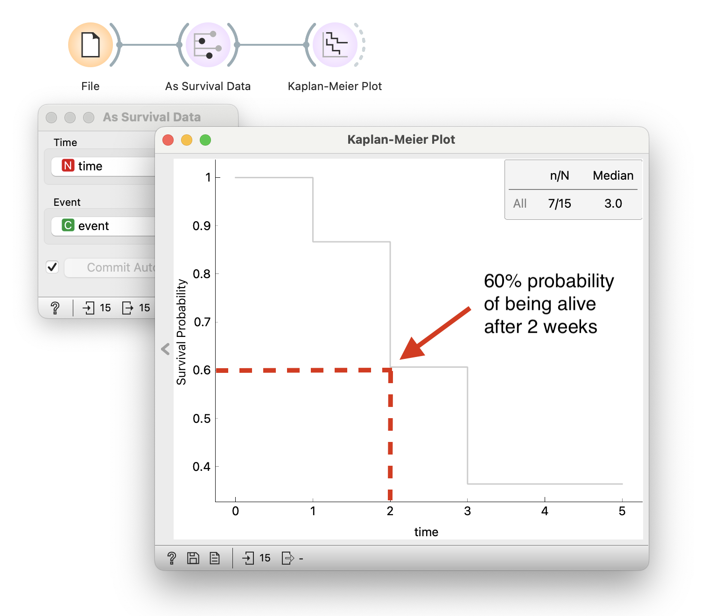

### Warmup Questions

<Question
  id="warmup-1"
  points={1}
  question="Survival analysis refers to a set of statistical techniques used to analyze data where the outcome variable is the time until an event's occurrence."
  scorer={(answer) => answer.toLowerCase() === "true"}
  options={["True", "False"]}
  trials={2}
  timeout={10}
/>

<Question
  id="warmup-2"
  points={1}
  question="In survival analysis, what is the type of outcome variable?"
  scorer={(answer) => answer.toLowerCase() === "continuous"}
  options={["Binary", "Continuous"]}
  trials={2}
  timeout={10}
/>

<Question
  id="warmup-3"
  points={1}
  question="The occurrence of an event is typically described by a binary variable with values of 0 or 1."
  scorer={(answer) => answer.toLowerCase() === "true"}
  options={["True", "False"]}
  trials={2}
  timeout={10}
/>

<Question
  id="warmup-4"
  points={1}
  question="If an individual has not experienced the event before the study ends, their survival time is considered censored."
  scorer={(answer) => answer.toLowerCase() === "true"}
  options={["False", "True"]}
  trials={2}
  timeout={10}
/>

Consider the following data:

<!!! float-aside !!!>
In our graph, the subjects (A, N, F, ...) are in rows. The start of the blue line tells us when we started observing the subject; this could be the time of the intervention, for example. The end of the blue line tells us when we last checked or observed an event. Observed events are marked with an X, all other data are censored. For example, we started observing subject K in week 5, and the event occurred in week 8. The total survival time for K is therefore 3 weeks. The survival time for N is 4 weeks, and at the last visit the event has not yet occurred.

Use the graph above and construct a data table ready for survival analysis. Use Excel or a similar spreadsheet program. Feed the data into Orange and answer the following questions:

<Question
  id="ex1-q1"
  points={1}
  question="What is the average survival time calculated from the constructed data table?"
  options={["0.5", "3.2", "2.2"]}
  answer="2.2"
  neutralOptions={["I don't understand the question."]}
  trials={2}
  timeout={10}>

  <Explanation after="correctOrMaxTrials">
  Typical survival data is composed of observations that include survival time and event indicators. The latter specifies if the event has occurred (event=1) or whether it has been censored (event=0). 

  Just by looking at the graph above, inferring any information about our collected data would be challenging. We instead summarize it in a data table:

  <!!! width-50 retina !!!>
  

  Calculating average survival time is now easier; we take the sum of the 'time' column and divide it by the number of rows <strong>(33/15 = 2.2)</strong>.

  <strong>Side note:</strong> Calculating average survival time this way is not the most informative or appropriate metric in survival analysis due to censoring. Methods like the Kaplan-Meier estimator and median survival time are more approriate. 
  </Explanation>
</Question>

<Question
  id="ex1-q2"
  points={1}
  question="What is the proportion of censored observations in the data?"
  options={["7/15", "8/15", "4/15"]}
  answer="8/15"
  neutralOptions={["I don't understand the question."]}
  trials={2}
  timeout={10}>

  <Explanation after="correctOrMaxTrials">
  The proportion of censored data is the number of censored observations divided by the total number of rows. In our data table, we look at 'event' column; we count <strong>8 censored</strong> observations out of <strong>15</strong>. 

  Alternatively, we can use the <a href="https://orangedatamining.com/widget-catalog/survival-analysis/kaplan-meier-plot/" target="_blank">Kaplan-Meier widget</a> to derive the answer. The widget reports the number of events we have observed out of all observations. In our data, we have only observed <strong>7 events</strong>, meaning <strong>8 are censored</strong>.

  <!!!retina !!!>
  

  You can download the workflow [here](explanation.ows).

  </Explanation>
</Question>

<!!! float-aside !!!>
By definition, median survival is the time at which half of the participants in a study population are expected to experience the event of interest. In Orange, you can view its value in the Kaplan-Meier widget.

<Question
  id="ex1-q3"
  points={1}
  question="What is the median survival time (in weeks) for our group of patients?"
  options={["4", "3", "1"]}
  answer="3"
  neutralOptions={["I don't understand the question."]}
  trials={2}
  timeout={10}>
  <Explanation after="correctOrMaxTrials">

  The <strong>median survival time</strong> represents the point at which the probability of survival decreases to 50%. This suggests that half of the study population is expected to survive up to this time.

  To calculate the median survival time in our data, we again use the <a href="https://orangedatamining.com/widget-catalog/survival-analysis/kaplan-meier-plot/" target="_blank">Kaplan-Meier widget</a>:

  <!!! retina !!!>
  

  You can download the workflow [here](explanation.ows).

  </Explanation>
</Question>

<Question
  id="ex1-q4"
  points={1}
  question="What is the survival probability of the patients at week two?"
  options={["60%", "50%", "80%"]}
  answer="60%"
  neutralOptions={["I don't understand the question."]}
  trials={2}
  timeout={10}>
  <Explanation after="correctOrMaxTrials">

  In the <a href="https://orangedatamining.com/widget-catalog/survival-analysis/kaplan-meier-plot/" target="_blank">Kaplan-Meier plot</a> the x-axis shows the time to the last observation, and the y-axis shows the overall survival probability. The survival curve tells us the probability of surviving past a certain time.

  <!!! retina !!!>
  

  In this example, the patient has a 60% probability of being alive after two weeks.

  You can download the workflow [here](explanation.ows).

  </Explanation>
</Question>
