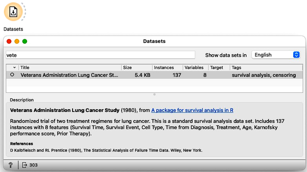
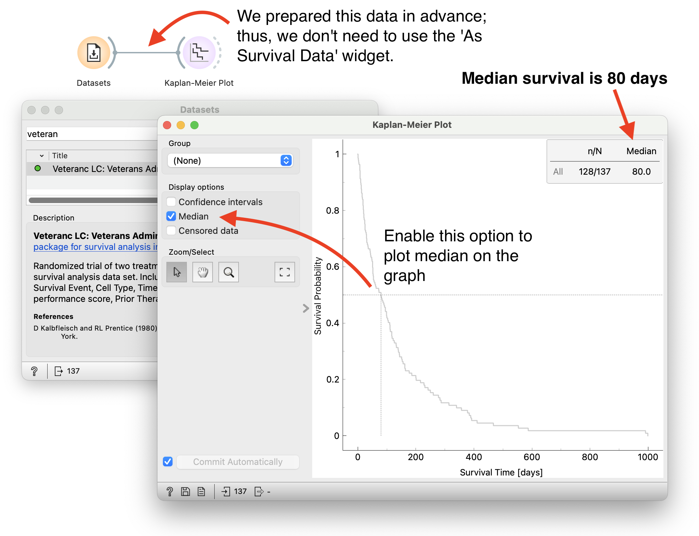
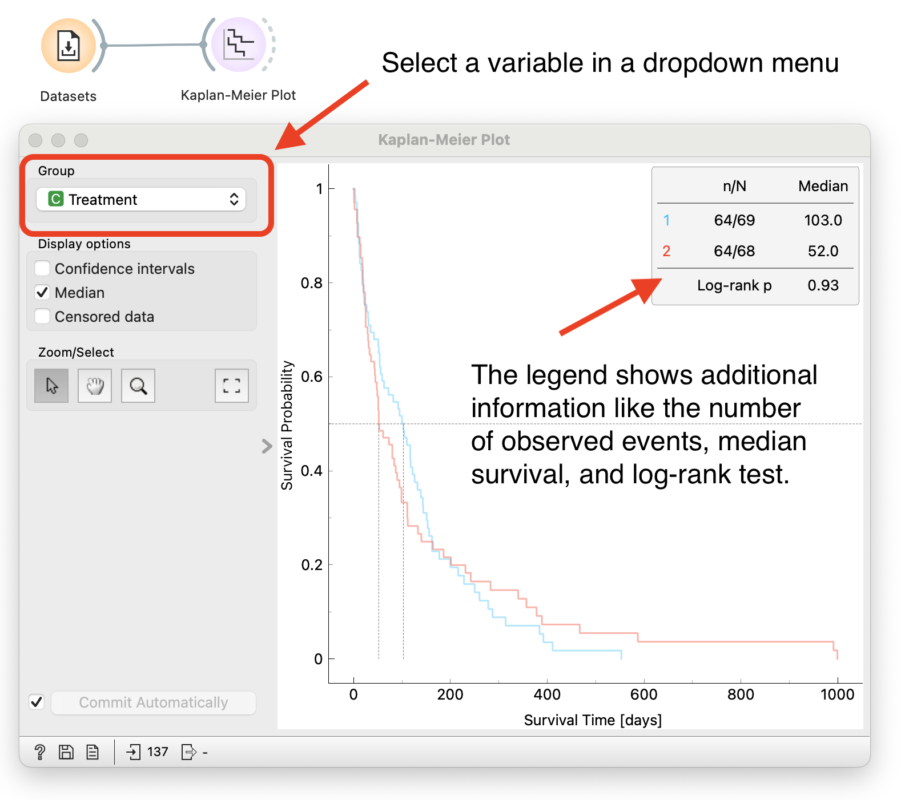
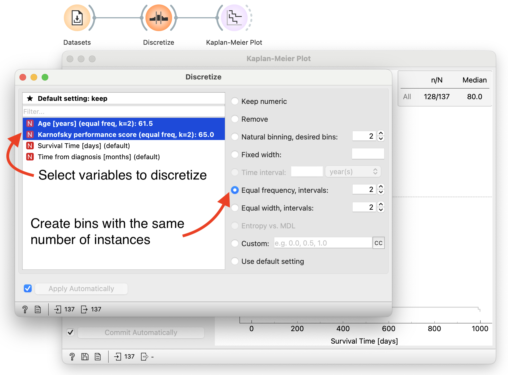
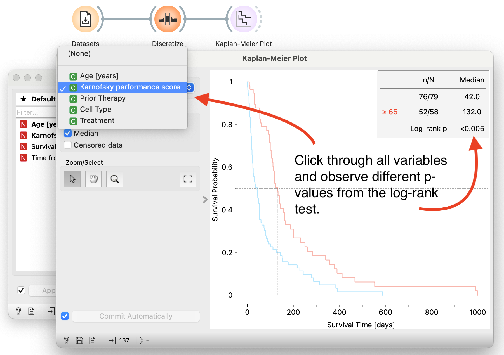
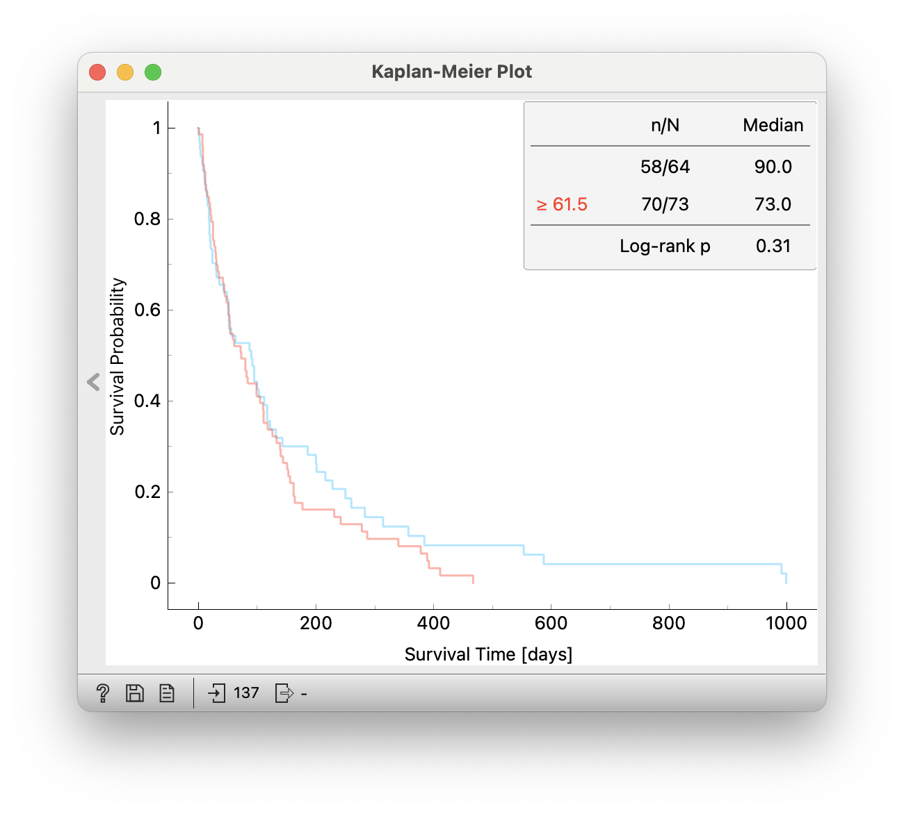
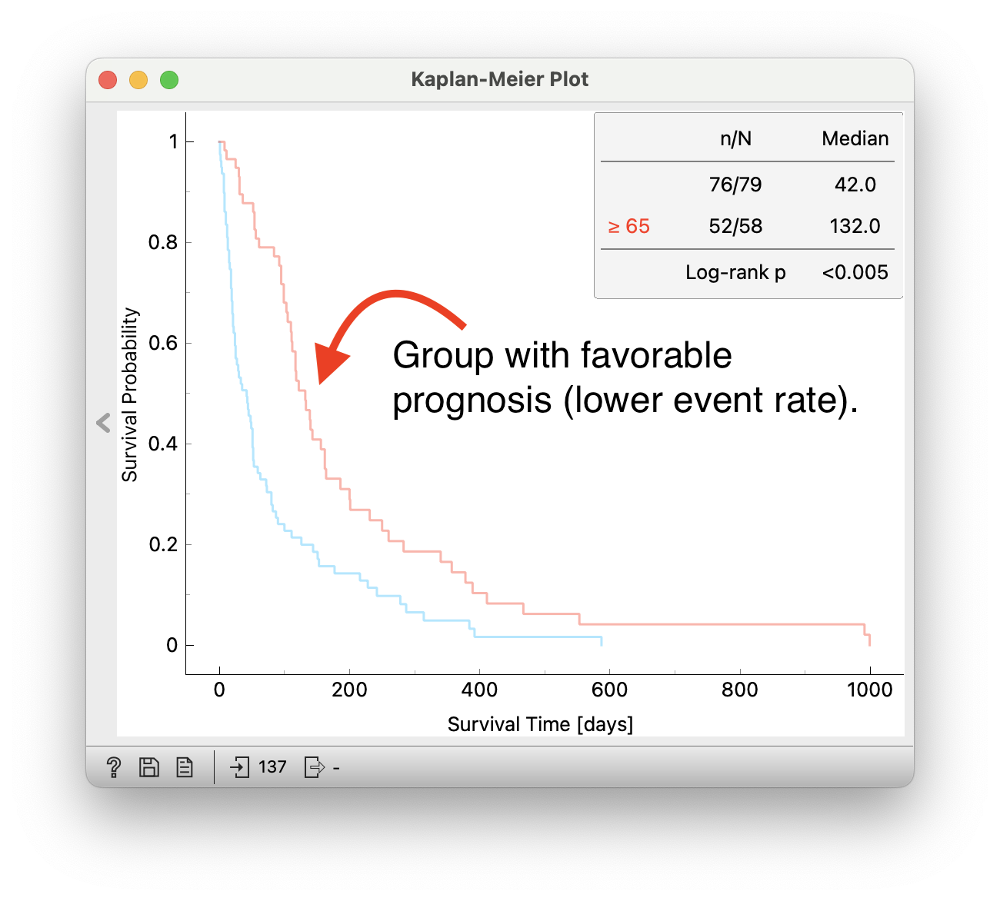

Here we take a look at the U.S. Veteran's Administration Lung Cancer Trial (from Kalbfleisch D and Prentice RL, 1980), in which male patients with advanced, inoperable lung cancer received either standard therapy or investigational chemotherapy. The data set includes 137 patients, 9 of whom left the study before death. The study was designed to assess the benefit of test chemotherapy and analyze the effects of other covariates.

Your first task is to load the data into Orange and view the survival curve for the entire cohort of patients.

<!!! float-aside !!!>
You can easily access this study's data in Orange using the Datasets widget. Search for "Veterans" and the dataset should appear at the top. This data already includes the information on time and event features (time since diagnosis [months], survival event), and you can feed the data to the Kaplan-Meier plot directly from the Datasets widget; you don't need to use the As Survival widget here, although it doesn't hurt.

<Question
  id="ex2-q1"
  points={1}
  question="What is the median survival time (in days)?"
  options={["105", "80", "64"]}
  answer="80"
  neutralOptions={["I don't understand the question."]}
  trials={2}
  timeout={10}>
  <Explanation after="correctOrMaxTrials">

  Here is the Orange workflow that we used to find median survival time:

  <!!! retina !!!>
  

  You can download the workflow [here](explanation_1.ows).
  </Explanation>
</Question>

The next task is to split the data into two cohorts. Our lung cancer trial dataset contains a variable called "Treatment" that indicates whether patients received standard chemotherapy or an alternative, test chemotherapy. We can use this variable to split the patient into two cohorts, the control and the test group. Use the Kaplan-Meier widget to answer the following questions:

<!!! float-aside !!!>
While you can calculate the desired summary statistics by combining some of the other widgets in Orange, you can get the answer to the questions here directly with the Kaplan-Meier widget by grouping the data in this widget accordingly. The graph legend reports the counts, where "N" in the legend refers to the size of the cohort, and "n" refers to the number of uncensored (surviving) patients.

<Question
  id="ex2-q2"
  points={1}
  question="How many patients received standard chemotherapy treatment? How many censored observations are in this cohort?"
  options={["68 patients, of which 4 are censored", "69 patients, of which 5 are censored", "69 patients, of which 4 are censored"]}
  answer="69 patients, of which 5 are censored"
  neutralOptions={["I don't understand the question."]}
  trials={2}
  timeout={10}>
  <Explanation after="correctOrMaxTrials">

  The <a href="https://orangedatamining.com/widget-catalog/survival-analysis/kaplan-meier-plot/" target="_blank">Kaplan-Meier widget</a> can group our data based on selected variables. To complete this task, we must select the 'Treatment' variable. The widget plots survival curves for both groups:

  <!!! retina !!!>
  

  The blue survival curve (Treatment=1) indicates patients with standard treatment. There are <strong>69 patients</strong> and <strong>64 observed events</strong>, meaning <strong>five observations are censored</strong>.

  You can download the workflow [here](explanation_2.ows).

  </Explanation>
</Question>

<Question
  id="ex2-q3"
  points={1}
  question="How many patients received test treatment? How many censored observations are in this cohort?"
  options={["69 patients, of which 4 are censored", "68 patients, of which 5 are censored", "68 patients, of which 4 are censored"]}
  answer="68 patients, of which 4 are censored"
  neutralOptions={["I don't understand the question."]}
  trials={2}
  timeout={10}>
  <Explanation after="correctOrMaxTrials">

  The workflow is the same in the previous question:

  <!!! retina !!!>
  

  The red survival curve (Treatment=2) indicates patients with test treatment. There are <strong>68 patients</strong> and <strong>64 observed events</strong>, meaning <strong>four observations are censored</strong>.

  You can download the workflow [here](explanation_2.ows).

  </Explanation>
</Question>

<Question
  id="ex2-q4"
  points={1}
  question="Choose the correct interpretation of the comparison between the two chemotherapy treatments:"
  options={["The test treatment cohort has a significantly better prognosis.", "The standard treatment cohort has a significantly better prognosis.", "Patient survival is not significantly different between treatment groups."]}
  answer="Patient survival is not significantly different between treatment groups."
  neutralOptions={["I don't understand the question."]}
  trials={2}
  timeout={10}>
  <Explanation after="correctOrMaxTrials">

  We still work with the same workflow:

  <!!! retina !!!>
  

  The p-value from the log-rank test is <strong>0.93</strong>; thus, <strong>patient survival does not differ significantly between treatment groups</strong>.

  You can download the workflow [here](explanation_2.ows).

  </Explanation>
</Question>

Let us analyze the effect of other variables in this data set. How does age affect patient survival? How is survival affected by the Karnofsky performance score?

<!!! float-aside !!!>
The Karnofsky Performance Score is a scale used to quantify a patient's general well-being and ability to carry out daily activities. Its typical values are 10 to 30 for fully hospitalized patients, 40 to 60 partially hospitalized patients, and 70 to 90 for patients able to care for themselves. Observe the differences between survival for two cohorts of patients split by the median value for age, and similar for two cohorts based on Karnofsky performance score. You can use the Discretize widget and "Equal frequency" discretization for grouping by the median value.

<Question
  id="ex2-q5"
  points={1}
  question="Survival is different (p<0.05) when patients in the lung cancer datasets are split into two cohorts (using the median as a threshold) by"
  options={["Age", "Karnofsky performance score", "Both Age and Karnofsky score", "Neither Age nor Karnovsky score"]}
  answer="Karnofsky performance score"
  neutralOptions={["I don't understand the question."]}
  trials={2}
  timeout={10}>
  <Explanation after="correctOrMaxTrials">

  Age and Karnofsky's performance score are continuous variables; thus, they don't appear in the <a href="https://orangedatamining.com/widget-catalog/survival-analysis/kaplan-meier-plot/" target="_blank">Kaplan-Meier widget</a> as group indicators. We first need to discretize them.

  The task is to split patients into two groups by the median value for a given variable and find the one that best separates survival curves.

  Below, we show how to utilize <a href="https://orangedatamining.com/widget-catalog/transform/discretize/" target="_blank">Discretize widget</a>:

  1.) Select variables to discretize and create two equally sized bins. For example, patients aged 62 or older are in one group and the rest in another.

  <!!! retina !!!>
  

  2.) Now they appear in the <a href="https://orangedatamining.com/widget-catalog/survival-analysis/kaplan-meier-plot/" target="_blank">Kaplan-Meier widget</a>. We can click through all the variables and observe statistics for each variable.

  <!!! retina !!!>
  

  We conclude that between variables 'Age' and 'Karnofsky's performance score,' the latter split patients into groups with the most significant difference in survival based on the log-rank test.

  You can download the full workflow [here](explanation_3.ows).

  <strong>Side note:</strong> The presented workflow is not the only way to do this kind of analysis. Remember, in the <a href="survival-analysis-notes#Exploring-Survival-Features">notes</a> we discuss how to create and compare groups using different approaches like using <a href="https://orangedatamining.com/widget-catalog/transform/selectrows/" target="_blank">Select Rows</a> or <a href="https://orangedatamining.com/widget-catalog/visualize/distributions/" target="_blank">Distributions</a> widgets.

  </Explanation>
</Question>

<Question
  id="ex2-q6"
  points={1}
  question="Select the correct interpretation of the effect on survival of the two features:"
  options={["Patients over 62 years of age have a significantly worse prognosis.", "Patients able to care for themselves have a significantly better prognosis.", "Neither is correct."]}
  answer="Patients able to care for themselves have a significantly better prognosis."
  neutralOptions={["I don't understand the question."]}
  trials={2}
  timeout={10}>
  <Explanation after="correctOrMaxTrials">

  Comparing the survival curves for the two groups of patients split by <strong>age</strong>:

  <!!! retina !!!>
  
  
  The two survival curves are not significantly different (p-value is 0.31). We can also visually observe no clear separation between survival curves.

  Comparing the survival curves of the two groups of patients split by <strong>Karnofsky's performance score</strong>:

  <!!! retina !!!>
  

  The survival curve for patients with a higher Karnofsky's performance score has a lower event (death) rate than the other group. The p-value is below 0.05, indicating a significant difference in survival between the two groups. Visualy survival curves are clearly separated. Indicating that patients able to care for themselves have a significantly better prognosis.

  </Explanation>
</Question>
