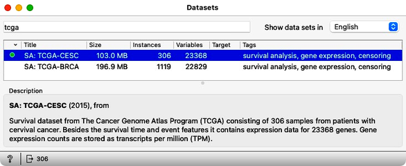
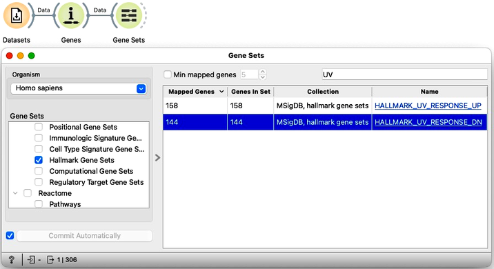
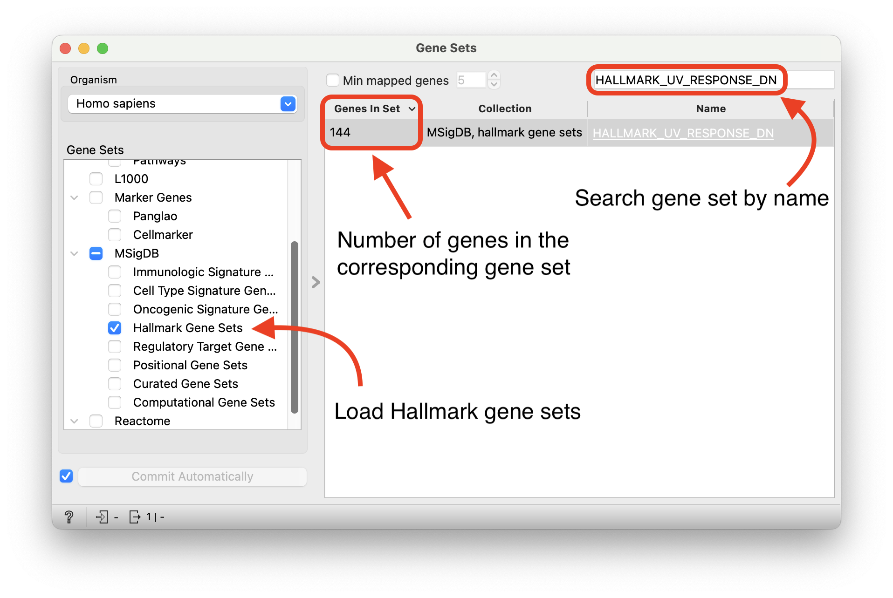
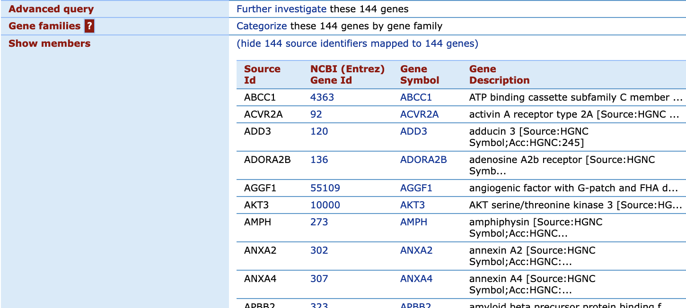
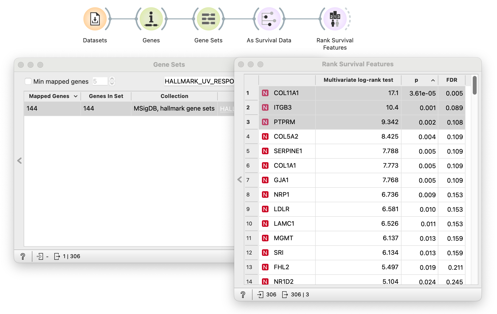
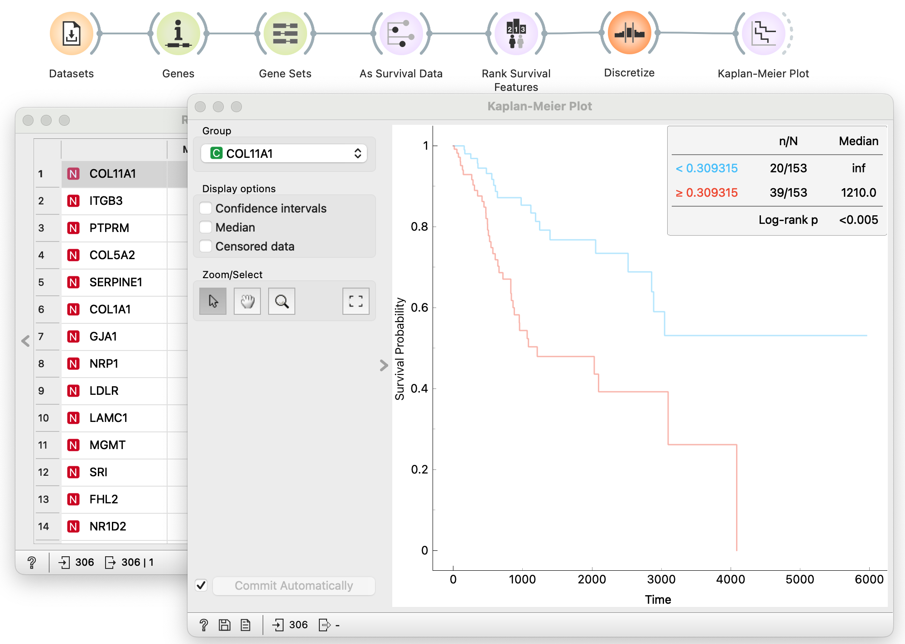
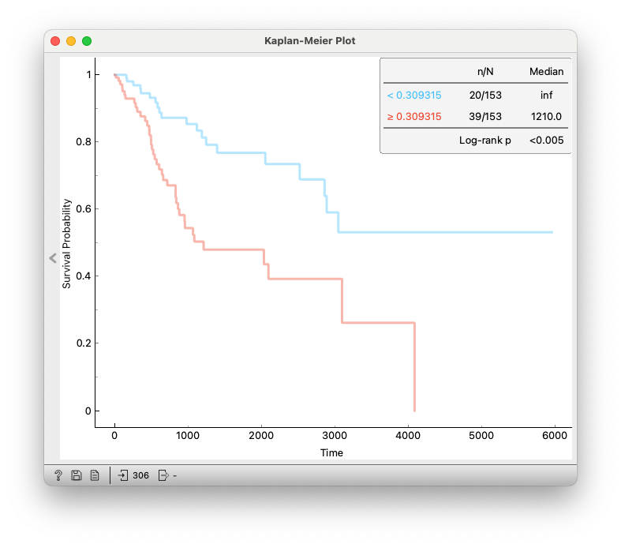
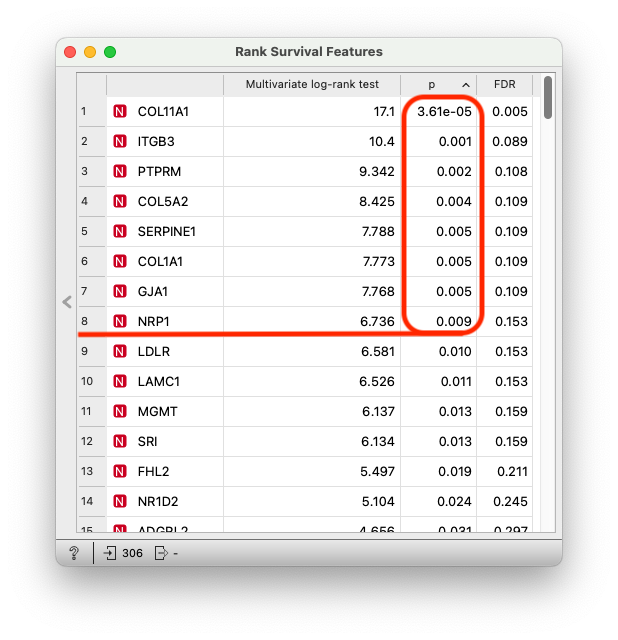

Let’s look at the cervical cancer data from [The Cancer Genome Atlas](https://www.cancer.gov/ccg/research/genome-sequencing/tcga) (TCGA). The dataset is available in the Datasets widget under “TCGA-CESC”. It includes survival data and gene expression values for 306 patients with cervical cancer. 

<!!! float-aside !!!>
In the literature, genes associated with regulating the UV response have been researched as potential therapeutic targets for cervical cancer treatment (e.g., [Gu et al., 2019](https://www.sciencedirect.com/science/article/abs/pii/S0378111918312228?via%3Dihub)). 

<strong>Your task is to identify a handful of potential marker genes associated with survival.</strong> For simplicity, you will look only at genes associated with a down-regulated ultraviolet radiation (UV) response. Oncogenes from the human papillomavirus (HPV), the leading cause of cervical cancer, have a complicated relationship with cellular response to UV. 

The gene set associated with a down-regulated UV response can be found in the Gene Sets widget under the [Molecular Signatures Database](https://www.gsea-msigdb.org/gsea/msigdb) (MSigDB) among the Hallmark Gene Sets under the name "HALLMARK_UV_RESPONSE_DN".

<!!! float-aside !!!>
Do not forget to install the Bioinformatics add-on first, and use Gene Sets widget from this add-on to answer the question.

<Question
  id="ex3-q1"
  points={1}
  question="How many genes are in the HALLMARK_UV_RESPONSE_DN gene set?"
  options={["158", "144", "200"]}
  answer="144"
  neutralOptions={["I don't understand the question."]}
  trials={2}
  timeout={10}>
  <Explanation after="correctOrMaxTrials">

  In Orange, we can access Hallmark gene sets through the <a href="https://orangedatamining.com/widget-catalog/bioinformatics/gene_sets/" target="_blank">Gene Sets</a> widget:

  <!!! retina !!!>
  

  The widget reports <strong>144 genes</strong> in the 'HALLMARK_UV_RESPONSE_DN' gene set. 
  
  This information is also accessible or verifiable through the [MSigDB website](https://www.gsea-msigdb.org/gsea/msigdb/human/geneset/HALLMARK_UV_RESPONSE_DN.html).

  <!!! retina !!!>
  

  </Explanation>
</Question>

Now load the TCGA-CESC data and consider only the genes that make up the down-regulated UV response hallmark gene set.

<Question
  id="ex3-q2"
  points={1}
  question="From the collection of down-regulated UV response genes, which are the top three genes that most influence cervical cancer progression?"
  options={["COL11A1, ITGB3, PTPRM", "ADORA2B, ZMIZ1, FBLN5", "PRKACA, SELENOW, OLFM1"]}
  answer="COL11A1, ITGB3, PTPRM"
  neutralOptions={["I don't understand the question."]}
  trials={2}
  timeout={10}>
  <Explanation after="correctOrMaxTrials">
  To test if the gene is associated with survival, we:
    1. Split the samples based on the median gene expression value.
    2. Estimate the survival curve for each group.
    3. Use a log-rank test to estimate how significantly different survival curves are between groups. 

  We use a similar approach to group the patient as in the Chapter 2, with a distinction that we now have to analyze 144 genes. To automate this process, we utilize the <a href="https://orangedatamining.com/widget-catalog/survival-analysis/rank-survival-features/" target="_blank">Rank Survival Features</a> widget:

  <!!! retina !!!>
  

  The output is a ranked list of features based on the p-value from the log-rank test. Genes <strong>COL11A1, ITGB3, and PTPRM</strong> are among the top-ranked ones.

  You can download the full workflow [here](explanation_3.ows).

  </Explanation>
</Question>

Create two patient groups based on the expression of the highest-ranked gene from the set of downregulated UV response genes. Then, chart the corresponding survival curves.

<!!! float-aside !!!>
To answer the following quiz questions, you will have to assemble the longest data analysis pipeline yet, using widgets such as Genes, Gene Sets, Rank Survival Features, Discretize, and Kaplan-Meier. You will become a survival analysis expert!

<Question
  id="ex3-q3"
  points={1}
  question="What is the difference in the survival curves of the cohorts when the patients are split according to the median expression of the top-ranked gene?"
  options={["No difference", "Moderate difference (p around 0.01)", "Substantial difference (p < 0.005)"]}
  answer="Substantial difference (p < 0.005)"
  neutralOptions={["I don't understand the question."]}
  trials={2}
  timeout={10}>
  <Explanation after="correctOrMaxTrials">
  We can select genes in the ranked table from the <a href="https://orangedatamining.com/widget-catalog/survival-analysis/rank-survival-features/" target="_blank">Rank Survival Features</a>  widget. This will reduce our data to include only selected genes. 

  We select the top-ranked gene (<strong>COL11A1</strong>), create groups based on the expression values of that gene, and estimate survival curves:

  <!!! retina !!!>
  

  We visually observe that survival curves appear different; they are well separated. The log-rank test confirms that the difference is significant (<strong>p < 0.005</strong>).

  You can download the full workflow [here](explanation_3.ows).

  </Explanation>
</Question>

<Question
  id="ex3-q4"
  points={1}
  question="Is overexpression of the top-ranked gene associated with increased or decreased survival?"
  options={["Increased survival", "Decreased survival"]}
  answer="Decreased survival"
  neutralOptions={["I don't understand the question."]}
  trials={2}
  timeout={10}>
  <Explanation after="correctOrMaxTrials">

  The survival curve in red indicates a group with high expression values (above the median expression). The survival curve in red shows decreased survival compared to the survival curve in blue. We can conclude that overexpression of the top-ranked gene is associated with decreased survival.

  <!!! retina !!!>
  

  </Explanation>
</Question>

<!!! float-aside !!!>
We again assume that, given a gene, cohorts are created by splitting the patients according to the median gene expression.

<Question
  id="ex3-q5"
  points={1}
  question="How many top-ranked genes from the collection of down-regulated UV response genes can result in cohorts with significant (p < 0.01) differences in survival curves."
  options={["Four", "Eight", "Twenty", "Thirty"]}
  answer="Eight"
  neutralOptions={["I don't understand the question."]}
  trials={2}
  timeout={10}>
  <Explanation after="correctOrMaxTrials">

  In the <a href="https://orangedatamining.com/widget-catalog/survival-analysis/rank-survival-features/" target="_blank">Rank Survival Features</a> widget, we sort genes by the p-value from the log-rank test. We see that the first eight genes have a p-value of less than 0.01.

  <!!! retina !!!>
  

  </Explanation>
</Question>
