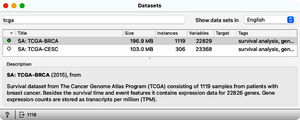
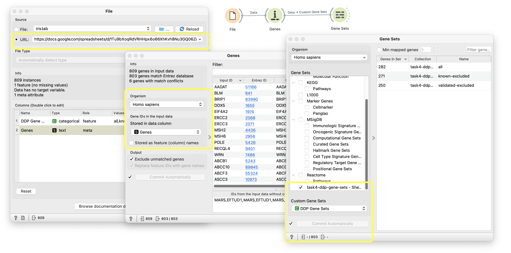
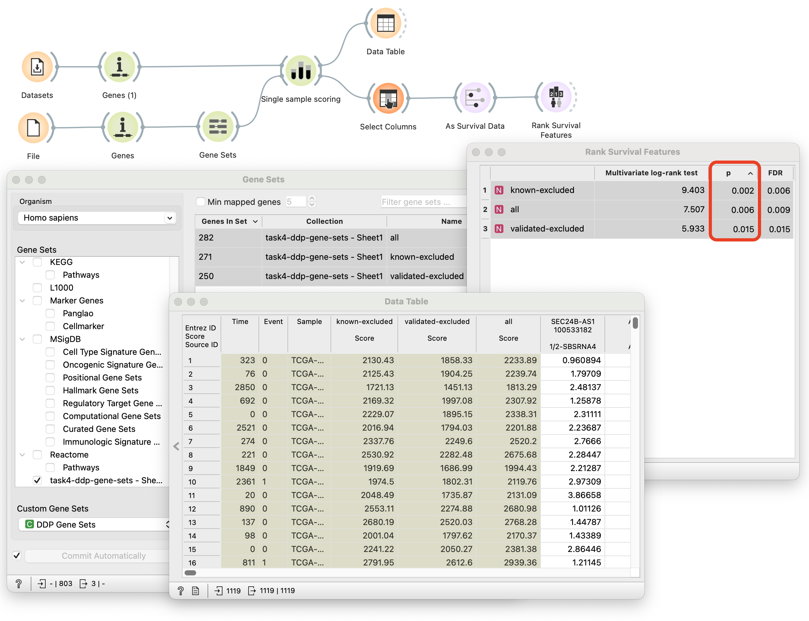
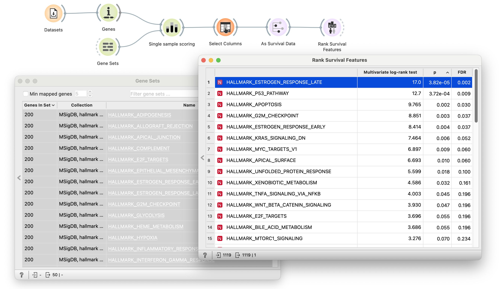
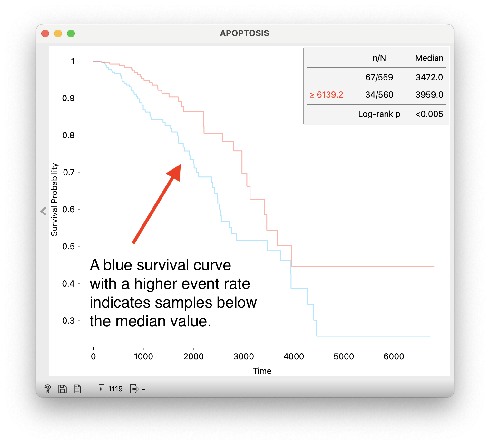
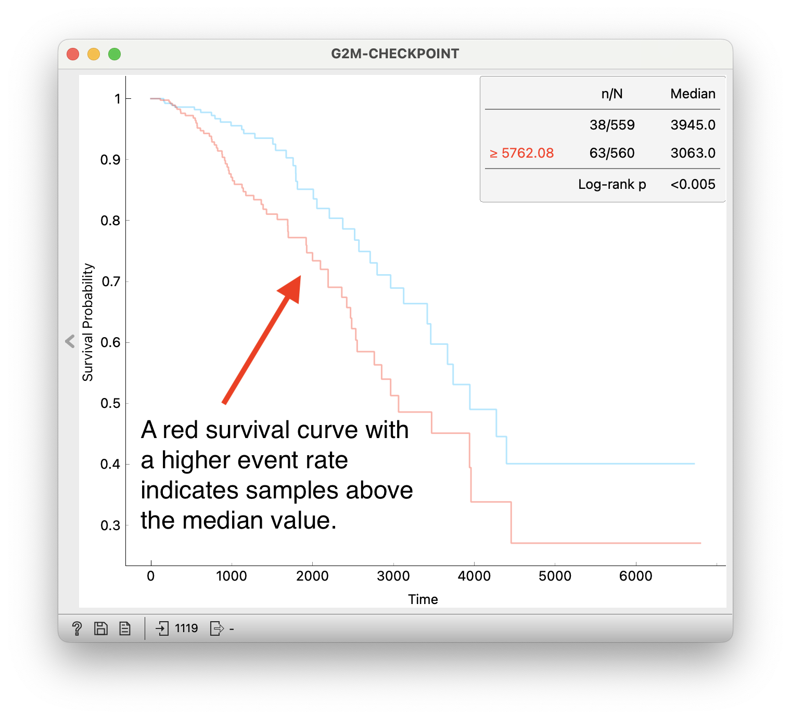

In 2019, Xia et al. published a [paper](https://www.ncbi.nlm.nih.gov/pmc/articles/PMC6344048/) identifying a new set of proteins that cause endogenous DNA damage when overproduced. The researchers discovered these DNA damage-up proteins (DDPs) in E. coli and identified 284 human homologs that are overrepresented among known cancer drivers.

They constructed three sets of genes: a set of all 284 candidate DDPs, a set of DDPs excluding known cancer drivers, and a set of DDPs excluding validated DDPs. Known cancer drivers are those whose gain- or loss-of-function in driving cancer has been established in the literature. Validated DDPs, on the other hand, refer to a subset of DDPs identified as actual DNA damage initiators in human cells by Xia et al. They evaluated the association of the three DDP gene sets with overall survival by calculating a gene set enrichment score for each sample and comparing two cohorts, one above and one below the top tertiles. Using any of the three DDP gene sets resulted in significant survival differences between the formed cohorts. These results indicate that there are genes among the discovered human DDP candidates that were previously unknown to drive cancer.

<strong>Check whether the three DDP gene sets (all, known excluded, validated excluded) are associated with decreased overall survival in the BRCA dataset, even when you split the patients into cohorts by the median of the enrichment scores</strong> (Xia and co-authors used tertiles for splitting, see above).

<!!! float-aside !!!>
The BRCA dataset is available in the Datasets widget under the name “TCGA-BRCA”.  Loading the dataset might take a minute.

The gene sets are available <a href="https://docs.google.com/spreadsheets/d/1Tu9bXoqRdVRHHpx6o66XhKvh8Nu3GQ06Zd3kh7zO9c8/edit?usp=sharing" target="_blank">here</a>. Use the worflow with File, Genes, and Gene Sets widget (see the image below) to load the gene sets into Orange. Once you load custom gene sets into the Gene sets widget, continue using the widget like you usually would. Alternatively, you can [download a pre-constructed workflow](load-custom-genesets.ows) and open it with Orange. 
<!!! width-max !!!>

<!!! float-aside !!!>
Remember to pass the TCGA-BRCA data through the As Survival Data widget. You will need to use the Single Sample Scoring widget to score the gene set. After scoring, remove the gene expression information using Select Columns and move the gene set scores to the Features section. You can score each gene set individually using Discretize and Kaplan-Meier combination, or just use the Rank Survival Features widget to calculate the p-values for the differences in the survival curves.

<Question
  id="ex4-q1"
  points={1}
  question="Which of the three gene sets are associated with decreased overall survival when you split by the median expression values? (given a significance threshold of 0.05)"
  options={["Only the whole DDP gene set.", "Only the gene set with excluded known drivers", "All of them"]}
  answer="All of them"
  neutralOptions={["I don't understand the question."]}
  trials={2}
  timeout={10}>
  <Explanation after="correctOrMaxTrials">

  Here, we utilize bioinformatics widgets to represent a set of genes with a single feature. <a href="https://orangedatamining.com/blog/single-sample-gsea-is-now-in-orange/" target="_blank">Here</a> is a short blog post describing the method.

  We can rank newly created features using the same procedure as in the previous exercise:

  <!!! retina !!!>
  

  The p-value from the log-rank test indicates that the survival rate between groups is different for all three gene sets. We can conclude that <strong>all of them</strong> are associated with decreased survival in TCGA-BRCA.

  The workflow is available [here](explanation_1.ows).

  </Explanation>
</Question>

We can use the same procedure to check the utility of other gene sets. Your next task is to rank all fifty gene sets from the Hallmark Gene Set collection with regards to overall survival in the BRCA dataset (order by p-value).

<!!! float-aside !!!>
Your workflow from the previous question is ready to answer this question as well; just switch to the Hallmark Gene Sets in the Gene Sets widget. Remember to seected all of the listed gene sets, as the Gene Sets widgets output only the setected sets. You will also need to move the computed scores in the Select Columns widget from the Metas panel to the Features.

<Question
  id="ex4-q2"
  points={1}
  question="Which gene set is ranked the highest with regard to survival?"
  options={["APOPTOSIS", "KRAS_SIGNALING_DN", "ESTROGEN_RESPONSE_LATE"]}
  answer="ESTROGEN_RESPONSE_LATE"
  neutralOptions={["I don't understand the question."]}
  trials={2}
  timeout={10}>
  <Explanation after="correctOrMaxTrials">

  The workflow is mostly the same as in the previous exercise. The only difference is in the gene set selection step.

  Hallmark genesets from the Molecular Signatures Database are readily available in the Gene Sets widget:

  <!!! retina !!!>
  

  Genes defining late response to estrogen are the highest ranked regarding survival in the TCGA-BRCA dataset.

  The workflow is available [here](explanation_2.ows).

  </Explanation>
</Question>

The 3rd and 4th ranking gene sets Hallmark Gene Set collection are associated with regulating DNA damage. Form groups based on these two gene sets and plot the corresponding survival curves.

<!!! float-aside !!!>
Here, you could stay with the workflow from the previous two questions, select the 3rd and 4th gene sets in the Rank Survival Features widget, and than pass it to Discretize to create an indicator variable for the patient cohorts. Make sure you discretize only the two gene sets, and not the Time variable.

<Question
  id="ex4-q3"
  points={1}
  question="Select the true answer. Decreased overall survival is associated with:"
  options={["Up-regulation of the 3rd gene set and down-regulation of the 4th gene set.",
            "Down-regulation of the 3rd gene set and up-regulation of the 4th gene set.",
            "Up-regulation of the 3rd gene set and up-regulation of the 4th gene set.",
            "Down-regulation of the 3rd gene set and down-regulation of the 4th gene set."]}
  answer="Down-regulation of the 3rd gene set and up-regulation of the 4th gene set."
  neutralOptions={["I don't understand the question."]}
  trials={2}
  timeout={10}>
  <Explanation after="correctOrMaxTrials">

  3rd and 4th ranking gene sets are HALLMARK_APOPTOSIS and HALLMARK_G2M_CHECKPOINT respectively.

  <!!! retina !!!>
  

    <!!! retina !!!>
  

  From this, we can conclude that decreased overall survival is associated with <strong>down-regulation of the 3rd gene set and up-regulation of the 4th gene set</strong>.

  </Explanation>
</Question>

*   Cox, D. R. (1972). Regression models and life-tables. *Journal of the Royal Statistical Society: Series B (Methodological)*, *34*(2), 187–202
